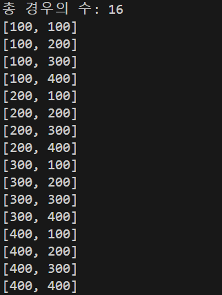
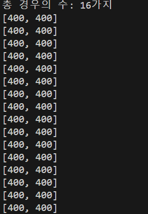
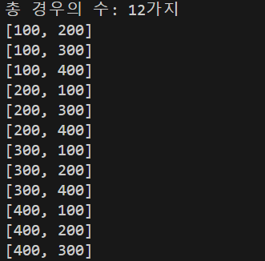
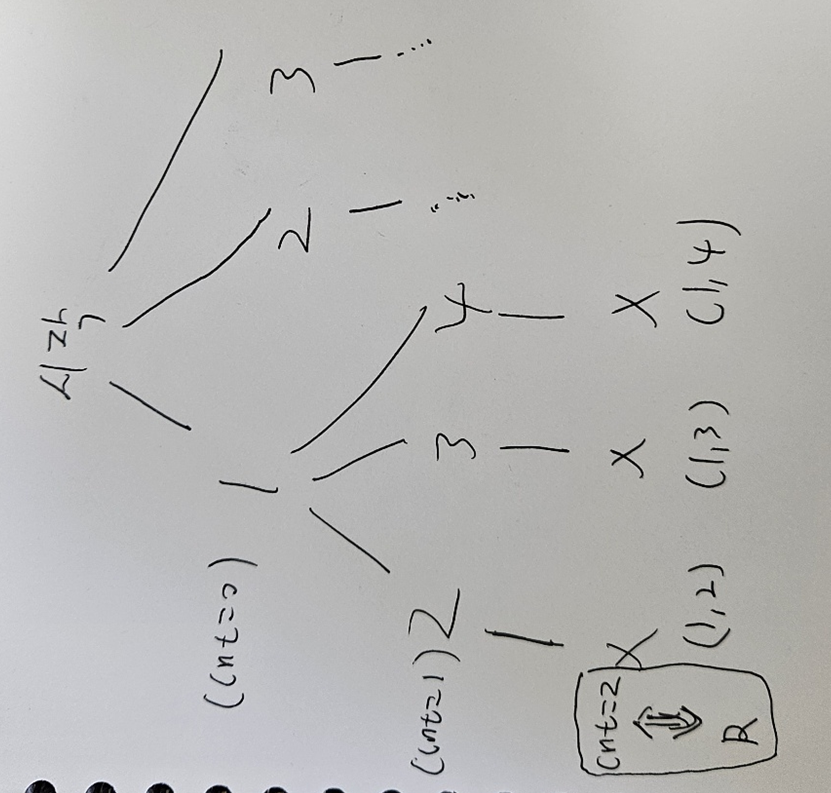
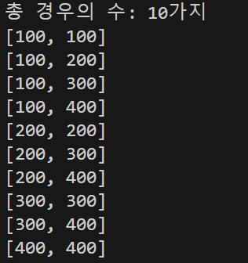
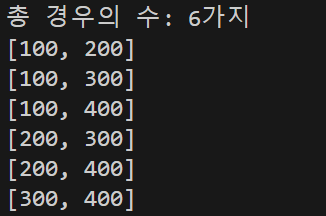

# 순열과 조합


순열과 조합은 자바에는 따로 라이브러리가 제공되지 않는다. ~~파이썬은 제공되는데..~~

따라서 코딩테스트에서 순열과 조합을 사용할 일이있으면, 직접 구현해서 사용해야한다.

원리만 이해하면 재귀를 통해서 쉽게 구현가능하니 하나씩 구현해보자.

swap하는 방식으로 구현할 수도 있지만, 여기서는 재귀로만 구현해보도록 하겠다.

swap을 이용한 방식은 레퍼런스가 많이있으므로 궁금하면 참고하길 바란다.


## 순열

### 중복 순열

중복 순열부터 시작하는 이유는 중복순열은 결국 주어진 n개중에서 r개를 뽑은 ``순서쌍의 모든 경우의 수``를 구하는 것인데,

이는 가장 간단한 재귀구조로 구현이 되기떄문에 중복 순열부터 시작하는게 이해를 돕는데 더 좋다고 생각해서이다.

#### 코드

```java
import java.util.*;

class Main {
    //각 순서쌍을 저장할 리스트 선언
    static List<int[]> answer = new ArrayList<>();

    public static void main(String[] args) {
        //순서쌍을 위한 변수 선언
        int[] permu = new int[2];
        //뽑히는 주체가 되는 숫자들을 가지고있는 변수선언
        //예시에는 임의로 100~400 4개의 숫자로 하였음
        int[] target = new int[] { 100, 200, 300, 400 };
        //중복순열 재귀함수 시작
        permutation(target, 2, 0, permu);
        //함수가 끝나면 경우의 수랑 각 순서쌍 출력
        System.out.printf("총 경우의 수: %d가지", answer.size());
        System.out.println();
        for (int[] ans : answer) {
            System.out.println(Arrays.toString(ans));
        }

    }
 
    //재귀함수 선언 부분
    public static void permutation(int[] target, int R, int cnt, int[] permu) {
        //cnt는 순서쌍의 순서위치를 의미. 0이 첫번째, 1이 두번쨰....
        //따라서 cnt==R이라면 이미 0~R-1 즉 R개가 뽑힌 것이므로 순서쌍을 저장하고 재귀를 끝낸다..
        if (cnt == R) {
            answer.add(permu.clone());
            return;
        }
        //순열,조합의 모든 종류를 통틀어서 가장 간단하다
        //그냥 모든 경우의수를 구하되, 순서위치만 1식 더해준다.
        for (int i = 0; i < target.length; i++) {
            permu[cnt] = target[i];
            permutation(target, R, cnt + 1, permu);
        }
    }
}
```
#### 출력 결과
<div align='center'>
    <br>
</div>

#### 설명
아마 코드에 달린 주석만 봐도 거의 이해가 될것이다.

그냥 N개중에 R개를 중복해서, 순서를 고려해서 뽑으려면 => N개를 반복문으로 돌리는데
그 안에서 몇번쨰 순서인지를 알려주는 cnt변수만 한개식 늘려주면서 재귀함수를 돌면된다.

이떄 주의할점은, `cnt==R`일떄, 즉 원하는 R개만큼 뽑았을때,
`answer.add(permu.clone())` 이렇게 permu를 clone메서드를 통해 `깊은복사`를하고 answer에 더해야된다는 것이다.

그렇지 않으면 answer에 더해지는 것들이 모두 하나의 주소(permu의 주소)만을 가르키게 되고 출력은 아래와 같이 나올것이다.
(얕은복사)

<div align='center'>
    <br>
</div>

### 순열

순열은 중복순열에서 visited라는, DFS/BFS 문제를 풀다보면 자주 사용하는 변수를 추가한 형태이다.

visited는 변수명 그대로, 해당 숫자(노드)를 이미 방문했는지 안했는지 판별할떄 사용하는 변수이다

boolean 값으로 사용하는게 일반적이나, int 값인 0/1로도 방문여부를 구분하기도 한다.

#### 코드
```java
import java.util.*;

class Main {
    static List<int[]> answer = new ArrayList<>();

    public static void main(String[] args) {
        //중복 순열과 거의 동일하나, 이번에는 방문여부를 확인하기위한 visited변수를 선언
        boolean[] visited = new boolean[4];
        int[] permu = new int[2];
        int[] target = new int[] { 100, 200, 300, 400 };
        //방문여부를 확인하는 변수가 매개변수로 추가된다
        permutation(target, 2, 0,visited, permu);
        System.out.printf("총 경우의 수: %d가지", answer.size());
        System.out.println();
        for (int[] ans : answer) {

            System.out.println(Arrays.toString(ans));
        }

    }
    //순열 구현
    public static void permutation(int[] target, int R, int cnt,boolean[] visited, int[] permu) {
        
        if (cnt == R) {
            answer.add(permu.clone());
            return;
        }
        for (int i = 0; i < target.length; i++) {
            //이부분이 핵심이다. 만약 현재 숫자가 이미 앞의 순서에서 방문(사용) 했다면, 
            // 아무 행위도 하지않고 다음숫자로 넘어간다. 중복을 방지하기 위해서이다.
            if(visited[i]==true){
                continue;
            }
            //현재 숫자가 앞의 순서에서 사용된적이 없으니,지금 순서에 현재숫자를 넣어도 된다.
            permu[cnt] = target[i];
            //현재숫자가 사용되었으니 visited를 true로 바꾼다.
            visited[i]=true;
            //다음 순서의 숫자를 찾으러간다.
            permutation(target, R, cnt + 1, visited,permu);
            // 현재 순서에서 현재 숫자는 모든 경우에서 사용되었으므로, 방문을 다시해도 되므로 초기화한다.
            visited[i]=false;

        }
    }
}
```

#### 출력 결과

<div align='center'>
    <br>
</div>

#### 설명

주석에 `숫자` 랑 `순서`가 같이 쓰여서 각각 뭘 뜻하는지 헷갈릴수도 있을거 같다.
`숫자`는 100~400을 말하고 `순서`는 cnt를 말한다.

여기서 자세히 설명해보겠다.

1. 위의 코드에서, 처음에 main에서 순열함수를 실행하면 permu의 현재순서(cnt==0)에 들어갈숫자를 찾기위해 반복문에서 100을 먼저 검사한다.


2. 100은 방문하지 않았으므로 현재순서(0번쨰)에 100을 넣는다


3. 그러면 [100,]이렇게 permu에 저장이 되어있을것이고, 100이라는 숫자는 사용되었으므로 visited[0]을 true로 바꿔준다.


4. 그런다음 permu의 다음순서(cnt+1==1)의 숫자를 정하기위해 다시 순열함수로 들어간다.


5. 그럼 cnt+1번쨰 함수에서 반복문은 다시 100부터 permu의 cnt+1번쨰에 넣으려고 할텐데, 이때 100은 방문한적이있기 떄문에(visited[0]==true)
아무 행위도 하지않고 그다음 200을 넣으려고 할것이다.


6. 200은 아직 방문안했으므로 cnt+1번쨰 넣을수있고 permu는 [100,200]이 된다. 그런다음 200은 사용했으니 visited[1]을 true로 바꿔준다.


7. 이제 permu의 (cnt+2==2)번쨰에 넣을 숫자를 찾으러 순열함수로 들어간다.


8. cnt+2번쨰 순열함수에서는 cnt==R 조건식에 걸리므로 permu를 answer에 저장하고 재귀함수를 나간다.


9. 나온 재귀함수는 현재 cnt+1번쨰 재귀함수이고, cnt+1번째에서는 200의 사용이 끝났으므로(즉 cnt번쨰가 100일떄 cnt+1번쨰가 200인 모든 경우의수를 재귀적으로 탐방하고 왔으므로) visited[1]=false로 바꾼다.
(cnt번쨰가 100이아닌 다음 재귀 탐방떄 재사용하기 위해서 방문을 초기화한다.)


10. 그런 다음 300을 permu의 cnt+1번째에 넣으려고 할것이다.


11. 300은 방문하지 않았으므로 cnt+1번쨰 넣을수 있고 permu는 [100,300]이 된다 그런다음 300은 사용했으니 visited[2]를 true로 바꿔준다


12. 이제 cnt+2번쨰 순열함수에서는 cnt==R 조건식에 걸리므로 permu를 answer에 저장하고 재귀함수를 나간다.


13. 나온 재귀함수는 현재 cnt+1번쨰 재귀함수이고, cnt+1번째에서는 300의 사용이 끝났으므로 visited[2]=false로 바꾼다.


14. 이렇게 400까지 반복을하고 cnt+1번쨰 재귀함수의 반복문이 끝나면 cnt번쨰 재귀함수로 돌아간다.


15. cnt번째에서는 100의 사용이 끝났으므로(즉 cnt번쨰가 100인 모든 경우의수를 재귀적으로 탐방하고 왔으므로) visited[0]=false로 바꾼다.
(cnt번쨰가 100이 아닌 다음 재귀 탐방떄 재사용하기 위해서 방문을 초기화한다.)


16. 이제 cnt번쨰함수의 반복문에서 100다음인 200을 permu의 cnt번째에 넣으려고 할텐데, 앞서 cnt번쨰가 100일때가 끝나면서 모든 visited가 false가 되었으므로
여태까지 했던 cnt가 100일떄의 과정을 똑같이 반복하면된다.

따라서 출력값은 출력결과의 사진처렴 나올것이다.

뭔가 어렵게 설명을 한거 같다...  헷갈린다면 그냥 주석을 무시하고 코드만 찬찬히 따라가봐도 이해할수 있을 것이다.


<div align='center' style="transform: rotate(90deg);">
    <br>
</div>
<br>
<br>
(DFS방식으로 숫자를 하나식 채우는데 깊이가 1식 길어질수록 자릿수도 하나식 뒤에꺼를 조사한다고 생각하면 된다.)

## 조합

### 중복 조합

조합에서는 방문여부를 확인하는 visited가 필요가없다.

중복조합은 순서에 상관없이 중복이 가능하게 뽑는 경우이다.

즉 순서는 상관없으므로 (100,200) 과 (200,100) 은 동일한 경우라고 생각해야 된다.

따라서 첫번째 숫자가 200일때 두번쨰숫자를 찾기위해 반복문을 다시 처음 100부터 돌릴필요 없이,

첫번쨰 숫자 보다 같거나 큰 200부터 찾아보면 된다.

즉 첫번쨰 숫자가 100일떈 두번쨰 숫자가 100부터~400까지..

첫번쨰 숫자가 200일떈 두번쨰 숫자를 200부터~400까지..

첫번쨰 숫자가 300일떈 두번쨰 숫자를 300부터~400까지..

.
.
.

K번쨰 숫자가 target[i]번쨰일떈 K+1번쨰 숫자를 target[i]부터~target[n]까지...

이렇게 생각하면 이해가 잘될 것이다.

그저 재귀 함수를 타고 들어갈때마다 
앞선 함수에서 target의 i번째까지 확인했으면,

i-1번쨰까지는 볼 필요없이 i번쨰 부터 반복문을 돌리면된다.

#### 코드
```java
import java.util.*;

class Main {
    static List<int[]> answer = new ArrayList<>();

    public static void main(String[] args) {
        
        int[] comb = new int[2];
        int[] target = new int[] { 100, 200, 300, 400 };
        combination(target, 2, 0, 0, comb);
        System.out.printf("총 경우의 수: %d가지", answer.size());
        System.out.println();
        for (int[] ans : answer) {
            System.out.println(Arrays.toString(ans));
        }

    }

    public static void combination(int[] target, int R, int idx, int cnt, int[] comb) {

        if (cnt == R) {
            answer.add(comb.clone());
            return;
        }
        //여기서 i=0 부터가 아니라 idx부터 돌리면 된다. 
        for (int i = idx; i < target.length; i++) {
            comb[cnt] = target[i];
            //idx에 i를 넣어줘 0번째~i-1번째까지는 반복문에서 제외시킨다.
            combination(target, R, i, cnt + 1, comb);

        }
    }
}
```
#### 출력 결과

<div align='center' >
    <br>
</div>

#### 설명

중복순열, 순열보다는 훨씬 코드가 간단해서 금방 이해될 것이다.

핵심은 현재 target[i]번째를 k번째 위치에 넣었다면, k+1번째위치는 i-1번째까지는 볼필요 없고

target[i] 부터 찾으면 된다는것이다.

combination(target, R, `i`, cnt + 1, comb); 이렇게 idx에 i을 넣어주면서
호출한다

### 조합

조합은 중복조합 완전히 똑같고, 단지 target[i]번쨰에서 재귀함수를 새로 들어간다면,

i번째부터가 아니라 i+1번쨰 부터 찾으면 된다는 것이다.

즉 중복조합은 i번쨰부터, 조합은 i+1번쨰 부터이다. 

중복되면 안되니 i+1번쨰 부터 찾아보는 것이다.

#### 코드
```java
import java.util.*;

class Main {
    static List<int[]> answer = new ArrayList<>();

    public static void main(String[] args) {

        int[] comb = new int[2];
        int[] target = new int[] { 100, 200, 300, 400 };
        combination(target, 2, 0, 0, comb);
        System.out.printf("총 경우의 수: %d가지", answer.size());
        System.out.println();
        for (int[] ans : answer) {
            System.out.println(Arrays.toString(ans));
        }

    }

    public static void combination(int[] target, int R, int idx, int cnt, int[] comb) {

        if (cnt == R) {
            answer.add(comb.clone());
            return;
        }
        for (int i = idx; i < target.length; i++) {
            comb[cnt] = target[i];
            //idx에 i+1를 넣어주면서 중복을 방지한다.
            combination(target, R, i+1, cnt + 1, comb);

        }
    }
}
```
#### 출력 결과

<div align='center' >
    <br>
</div>


#### 설명

중복조합과 거의 일치하는 코드이다. 단 중복은 허용안되기에 

k번째에 target[i]를 골랐다면, 다음 k+1번쨰의 재귀함수에는 target[i+1]번째 부터 반복문을
시작하면 되므로  

combination(target, R, `i+1`, cnt + 1, comb); 이렇게 idx에 i+1을 넣어주면서
 호출한다
