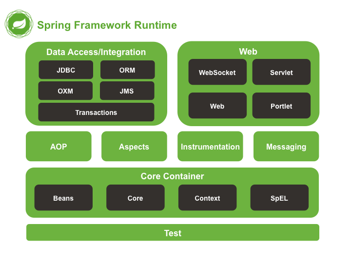

## Spring의 등장 배경

스프링이 등장하기전, EJB (Enterprise JavaBeans)라는 애플리케이션의 업무 로직을 담당하는 자바 표준 기술이 있었다.

EJB의 등장으로 개발한자는 비즈니스 로직에 집중할수 있는 환경을 가지게 되었지만, `EJB 컨테이너` 라는, EJB를 정말 어렵게 만든 주범떄문에 곤란함을
겪고 있었다.

EJB컨테이너는 우리가 흔히 사용하는 스프링 컨테이너로서의 개념과 크게 다르지않다.
즉, 컨테이너 기술이란  개발시 필요한 객체들을 관리하는 컨테이너를 만들어서 필요할 때마다 컨테이너로 부터 객체를 받는 기술이다.

만약 `트래픽이 한번에 몰릴떄` 객체를 그때그떄 생성다면 `서비스 부하와 트랜잭션 양이 많아서` 처리에 오래걸릴 것이다.
따라서 EJB컨테이너는 당시에는 획기적이라는 평가를 받았고, Java 진영에서 표준 기술로서 인정도 받았다.

하지만 이런 좋은 기술임에도, 사용이 너무 번거롭고 불편해서 Java개발자들이 많은 불편함을 겪었다.

왜냐면 EJB컨테이너를 사용하기위해서는 클래스 간 상속, 인터페이스의 구현 등 준비해야될게 많았는데, 
**비즈니스 로직구현에 써야될 시간을 EJB컨테니어를 설정하는 시간에 할애**하게 되어서 배보다 배꼽이 크게 되었다.

또한 특정 환경과 기술에 종속적인 코드, 부족한 이동성(Portabilty)때문에 개발자들은 
복잡하지않고, 어디에도 종속되지 않는 객체로 돌아가자는 의미에서 마틴 파울러의 `POJO(Plain Old Java Object)`라는 용어가 등장하게 되었다.

그런 요구에 맞춰 나온게 바로 스프링이였고, 마침내 `EJB라는 겨울이 가고 봄이 왔다는 의미에서 Spring`이라고 지었다고 한다.

## Spring 의 핵심 개념

Spring은 스프링 프레임워크의 핵심 모듈을 모아서 만든 프레임워크이다.

따라서 스프링의 핵심개념들을 살펴보겠다.

    

필자는 JDBC, ORM, 트랜잭션 같은 데이터 영역은  JPA를 하면서 배웠고

Web영역은 Spring MVC를 배우면 서블렛이나 소켓같은 개념을 공부하였다.

(Test는 필자도 Junit5과 Spring 어노테이션을 활용한 단위, 통합테스트 구현만 해보았고
깊이있게 알지는 못한다)

따라서 여기서는 
그밑에 있는 코어단에서 중요한 것들을 가볍게 정리해 보겠다(깊이있게 이해하려면 어차피 실제로 활용해봐야 된다고 생각한다.)

### Core (DI, IoC)

스프링의 근간, 내가 만든 클래스를 스프링이 직접 관리하여 어플리케이션을 동작하게 한다

### AOP(Aspect Oriented Programming)

공통적인 코드를 프레임워크 레벨에서 지원해주는 방법

### Validation, Data binding

검증 그리고 외부에서 받은 데이터를 담아내는 방법

### Resource

스프링 내부에서 설정이 들어있는 파일들에 접근하는 동작 원리

### SpEL

짧은 표현식을 통해 필요한 데이터나 설정 값을 얻어올 수 있게 하는 특별한 형태의 표현식에 가까운 간편한 언어

### Null-Safety

단어 그대로 null 에게서 안전한 프로그램 코드를 작성하는 기술을 제공

## 스프링의 디자인 철학

- 모든 기능에서 다양한 가능성(다양한 모듈)을 사용 가능, 심지어 외부 모듈을 활용 가능
  - 너무 높은 자유도 어떤 점에서는 스프링을 어렵게 하는 요소
  
  
- 유연하게 계속 추가 개발을 하고 있는 프레임워크

- 이전 버전과의 강력한 호환성
  - 상당히 성숙하고 관리된 프레임워크이기 떄문에 레거시가 많음
  - 너무 많은 레거시 때문에 코드의 복잡성이 높아지긴 함
  - 따라서 스프링 내에는 `동일한 역할을 하는 다양한 기능`이 있으며, 그 중에서 `적합한 방법을 선택`할 수 있어야 함

- API 디자인을 섬세하게 노력한다
  - 스프링 코드 자체가 하나의 좋은 참고 소스

- 높은 코드 품질을 유지하려 함
  - [스프링 프로젝트 github](https://github.com/orgs/spring-projects/repositories)은 아주 좋은 참고 소스이자 PR과 이슈 관리도 좋은 프로세스 참고용

→ 한마디로 높은 자유도를 주고 계속 발전하는 고품질의 다양성이 있는 프로젝트, 그런데 너무 자유로워서 때론 어렵다.(많은 레거시, 선택사항 존재)

다음 포스트는 앞서 언급한 코어 기술에대해서 하나씩 설명해 보겠다.
