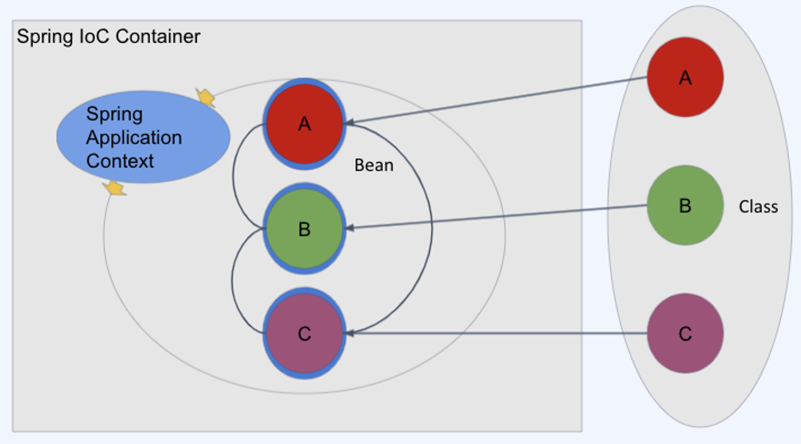
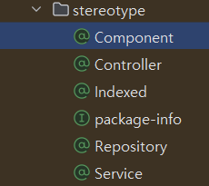

## IoC(Inversion of Control), DI(Dependency Injection)

<div align='center'>
    
</div>

- IoC나 DI는 레고와 같은 것이다
  - 스프링이 바닥판처럼 깔려있고, 우리는 그 위에서 멋진 조립(어플리케이션)을 만들면 된다

### DI(의존성 주입)
전통적인 프로그래밍 모델에서는 `객체가 자신의 의존성을 생성하고 관리`한다. 

간단한 예로
```java
public class 청룡언월도 {
    ...
    ...
}
```
```java
public class 관우 {
    private 청룔언월도 언월도=new 청룡언월도();

    public 관우() {
        언월도 = new 청룡언월도();
    }
}
```
이런식으로 `관우 클래스 내부에서 청룡언월도 객체를 생성`했기떄문에 이것은 의존성 주입이아니라
`스스로 의존성을 만든것`이다

하지만 의존성 주입을 적용할 경우

```java
@Component // 스프링 컨테이너에 Bean으로 등록
public class 청룔언월도 {
    ...
    ...
}
```
```java
public class 관우 {
  @Autowired // 스프링 컨테이너에 있는 청룡언월도 타입의 Bean을 주입
  private 청룔언월도 언월도;
}

```
위 코드에 경우 청룡언월도 `객체(Bean)를 스프링 컨테이너에 등록`하고, 스프링 컨테이너에서 관우의 언월도 멤버변수에
`Bean객체를 주입`할 수 있게 해준 것이다.

### IoC(제어의 역전)

스프링에서 우리는 객체의 의존성을 제어의 역전이라는 개념을 통해 주입 받을 수 있다.

IoC에 의미는 다음과 같다.
>스프링 컨테이너가 필요에 따라 개발자 대신 Bean들을 관리(제어)해주는 행위

즉 개발자가 객체들을 제어하는게 아니라, 스프링 컨테이너(IoC container)에서 객체들을 등록하고 제어해주는 것이다.

덕분에 우리는 마치 레고 조립과 같이, 스프링이 기반을 제공하고 개발자는 그 위에 자신의 독특한 애플리케이션을 
조립하면서 비즈니스 로직에만 집중할 수 있게 되는 것이다.

### IoC Container(스프링 컨테이너)

> 스프링 프레임워크에서 객체를 Bean객체로서 등록하고 의존성을 관리해주는 컨테이너

IoC 컨테이너는 객체의 생성을 책임지고, 의존성을 관리한다. 또한 
생성부터 소멸까지의 LifeCycle(생명주기)를 관리한다.

개발자들이 직접 객체를 생성할 수도 있지만 컨테이너에게 맡긴다. 이렇게 맡김으로서 개발자들은 비즈니스 로직에 더욱 집중할 수 있게 된다.

Spring Container는 크게  `BeanFactory`와 `Application Context` 로 나뉜다

#### BeanFactory

Spring의 `가장 기본적인 IoC 컨테이너 인터페이스`로, Bean의 생성, 설정, 조회, 관리 등의 기본적인 기능을 제공한다.

하지만 `메세지 처리`나 `실행환경 관리`같은 고급 기능은 제공하지 않는다.

```java
//
// Source code recreated from a .class file by IntelliJ IDEA
// (powered by FernFlower decompiler)
//

package org.springframework.beans.factory;

import org.springframework.beans.BeansException;
import org.springframework.core.ResolvableType;
import org.springframework.lang.Nullable;

public interface BeanFactory {
    String FACTORY_BEAN_PREFIX = "&";

    Object getBean(String name) throws BeansException;

    <T> T getBean(String name, Class<T> requiredType) throws BeansException;

    Object getBean(String name, Object... args) throws BeansException;

    <T> T getBean(Class<T> requiredType) throws BeansException;

    <T> T getBean(Class<T> requiredType, Object... args) throws BeansException;

    <T> ObjectProvider<T> getBeanProvider(Class<T> requiredType);

    <T> ObjectProvider<T> getBeanProvider(ResolvableType requiredType);

    boolean containsBean(String name);

    boolean isSingleton(String name) throws NoSuchBeanDefinitionException;

    boolean isPrototype(String name) throws NoSuchBeanDefinitionException;

    boolean isTypeMatch(String name, ResolvableType typeToMatch) throws NoSuchBeanDefinitionException;

    boolean isTypeMatch(String name, Class<?> typeToMatch) throws NoSuchBeanDefinitionException;

    @Nullable
    Class<?> getType(String name) throws NoSuchBeanDefinitionException;

    @Nullable
    Class<?> getType(String name, boolean allowFactoryBeanInit) throws NoSuchBeanDefinitionException;

    String[] getAliases(String name);
}

```
내부 함수들을 살펴보면 `Bean객체를 가져오거나`, 해당 이름의 `Bean이 등록되어있는지 확인`하거나, `Scope가 싱글톤인지, 프로토타입인지 확인`하는 함수들이 있음을 알 수 있다.

#### ApplicationContext

ApplicationContext는 `BeanFactory를 확장한 인터페이스`이다.

어플리케이션 컨텍스트는 `메시지 처리`, `환경변수(프로파일) 관리`, `애플리케이션 레벨의 리소스 로딩`과 같은 추가적인 기능을 제공한다.

```java

package org.springframework.context;

import org.springframework.beans.factory.HierarchicalBeanFactory;
import org.springframework.beans.factory.ListableBeanFactory;
import org.springframework.beans.factory.config.AutowireCapableBeanFactory;
import org.springframework.core.env.EnvironmentCapable;
import org.springframework.core.io.support.ResourcePatternResolver;
import org.springframework.lang.Nullable;

public interface ApplicationContext extends EnvironmentCapable, ListableBeanFactory, HierarchicalBeanFactory, MessageSource, ApplicationEventPublisher, ResourcePatternResolver {
  @Nullable
  String getId();

  String getApplicationName();

  String getDisplayName();

  long getStartupDate();

  @Nullable
  ApplicationContext getParent();

  AutowireCapableBeanFactory getAutowireCapableBeanFactory() throws IllegalStateException;
}

```
ApplicationContext가 상속받은 인터페이스들을 하나식 살펴보자.

- ListableBeanFactory:  BeanFactory를 확장한 인터페이스로 `빈들의 전체 목록을 조회`하거나, 특정 타입에 맞는 `빈들을 리스트로서 검색하는 기능을 제공`한다. <br> 이는 `애플리케이션 레벨에서 빈의 관리 및 접근`을 가능하게 해준다 


- EnvironmentCapable: 해당 인터페이스에 getEnvironment() 메서드를 통해 `실행환경(프로파일)에 접근 및 관리` 할수 있다


- HierarchicalBeanFactory: 빈 팩토리의 계층 구조를 관리한다. 즉, 부모 컨텍스트에서 빈을 참조할 수 있게 해주며, 이는 `확장된 의존성 관리`를 가능하게 한다.


- MessageSource: 국제화(i18n) 기능을 제공하는 인터페이스이다. 다양한 `언어와 지역 설정에 맞는 메시지를 로드하고 관리`할 수 있게 해준다. 이는 애플리케이션에서 메시지 처리와 직접적으로 관련 있다.


- ApplicationEventPublisher: 이벤트 발행 기능을 제공하여, `애플리케이션 내에서 발생하는 다양한 이벤트를 관리하고 전파`할 수 있다. 이는 애플리케이션의 상호작용과 동적인 반응을 가능하게 한다


- ResourcePatternResolver: 소스 로딩 기능을 제공하는 인터페이스이다. 파일 시스템이나 클래스패스, 외부 URL 등에서 `리소스 패턴을 해석하여 리소스를 로드`할 수 있게 해준다.

따라서 우리는,
ApplicationContext가 `BeanFactory를 확장한 인터페이스`이고,

`BeanFactory의 기본적인 기능`과 `실행환경에 접근 및 관리`, `메시지 처리`, `이벤트 발행`, `리소스 로딩`과 같은 추가적인 기능을 제공함을 확인할 수 있었다.


#### BeanFactory VS ApplicationContext

앞서 살펴 보았듯이 ApplicationContext는 BeanFactory의 모든 기능을 포함하고 여러 추가 기능들을 제공해주기 떄문에

이 추가기능들을 사용하는 것보다 메모리 소모량 축소가 더욱 중요한 상황이 아니라면 ApplicationContext를 사용하는것이 더 좋아보인다.

### Bean

#### 자바에서의 Bean

자바에서 Bean객체란  POJO의 한 형태인 javaBean 객체를 의미하며, 정의는 아래와 같다

> 데이터를 저장하기 구조체로 자바 빈 규약이라는 것을 따르는 구조체이다


자바 빈 규약 중 중요한 몇가지는 아래와 같다.
- private하게 프로퍼티를 선언하고 getter/setter로만 데이터를 접근한다.
- getter 와 setter는 접근자가 public으로 선언되어야 한다.
- 인수(argument)가 없는 기본 생성자가 있다.
- 직렬화 되어 있어야 한다. (선택사항)

```java
public class JavaBean {
  
	private String id;
	private Integer count;

	public JavaBean(){}

	public String getId() {
		return id;
	}

	public void setId(String id) {
		this.id = id;
	}

	public Integer getCount() {
		return count;
	}

	public void setCount(Integer count) {
		this.count = count;
	}
}
```

#### 스프링에서의 Bean

스프링 프레임워크에서 말하는 Bean 은 조금 더 확장된 의미를 가진다.<br>
스프링에서 Bean 이라고 할 때는, `스프링 IoC컨테이너에 의해 관리되는 객체`를 의미한다.

- 스프링 IoC 컨테이너에 의해 생성되고 관리되는 객체
- 자바에서처럼 new Object(); 로 생성하지 않는다
- 각각의 Bean들 끼리는 서로를 편리하게 의존(사용)할 수 있음

<div align='center'>
    
</div>

위 사진 처럼, 실제로 Spring Application Context에서 `Bean객체들이 리스트로 등록`이 되어있다.

(앞선 Application 선언 부분에 ListableBeanFactory를 상속받은 부분 참조)

각 객체 A, B, C를 빈으로 등록한다는 것은 단순히 우리가 만들 클래스를 그대로 쓴다는 의미가 아니다.

Spring ApplicationContext는 우리가 만든 클래스에 `어노테이션으로 정의한 설정들을 입혀준다`.

예를들어 @Controller이면 컨트롤러역할과 관련된 설정을, @Service면 서비스 계층과 관련된 설정을, 아니면 그냥 @Component면 기본 설정 등등을
적용해준다.

또한 각 설정한 `어노테이션을 기반으로 객체간의 의존성도 판단`해서 각 의존성에 맞게 객체 주입을 해준다

그리고  `Scope에 따라 (일반적으로 싱글톤 타입으로) 인스턴스로 실체화` 된다. 

### Bean의 등록

- 과거에는 xml로 설정을 따로 관리하여 등록(불편하고 귀찮음)
- 현재는 annotation 기반으로 Bean 등록
  - @Bean, @Controller, @Service

### 빈 정의(Bean Definition)

스프링에서 빈(bean)을 생성하고 관리하는 데 필요한 메타데이터

- Class 경로


- Bean의 이름
  - 기본적으로는 원본 Class 이름에서 첫 문자만 소문자로 변경  → accountService, userDao
  - 원하는 경우 커스텀 가능


- Scope : Bean을 생성하는 규칙
  - singleton : 컨테이너에 단일로 생성
  - prototype: 작업 시마다 Bean을 새로 생성하고 싶을 경우
  - request: http 요청마다 새롭게 Bean을 생성하고 싶은 경우


- 의존성 정보
  - 해당 Bean이 다른 Bean에 의존하는 경우, 이 의존성도 빈정의의 포함

  
- 생명주기 콜백
  - 빈의 생명주기 동안 호출될 메소드

### Bean LifeCycle callback(빈 생명주기 콜백함수)

- callback : 어떤 이벤트가 발생하는 경우 호출되는 메서드


- Bean lifecycle callback
  - Bean을 생성하고 초기화하고 파괴하는 등 특정 시점에 호출되도록 정의된 메서드

- 주로 많이 사용되는 콜백
  - @PostConstruct : 빈 생성 시점에 필요한 작업을 수행
  - @PreDestroy : 빈 파괴(주로 어플리케이션 종료) 시점에 필요한 작업을 수행

대표적으로 네트워크 커넥션에 사용한다.

```java
import javax.annotation.PreDestroy;

@Component
public class NetworkClient {
  private String url;

  public NetworkClient() {
    System.out.println("생성자 호출, url = " + this.url);
  }

  @PostConstruct
  //생성시에 호출되는 함수
  public void init() {
    System.out.println("NetworkClient.init");
    connect();
    call("초기화 연결 메시지");
  }

  @PreDestroy
  //빈 파괴시점에 호출되는 함수
  public void close() {
    System.out.println("NetworkClient.close");
    disconnect();
  }

  public void disconnect() {
    System.out.println("disconnect from " + url);
  }
}
```

### 한 클래스가 빈에 등록되고 사용되어 끝날때 까지의 과정을 말해보자
앞서 살펴본 내용을 바탕으로,
@Component 어노테이션을 사용해 클래스를 빈(Bean)으로 등록후의 사용, 소멸까지의 LifeCycle을 살펴보겠다.


#### 1. 컴포넌트 스캔
스프링 애플리케이션을 시작할 때 `@ComponentScan`을 사용하여 설정된 패키지 내에서 `@Component` 어노테이션이 적용된 클래스를 자동으로 검색한다.

이것은 또한 `@Service`, `@Repository`, `@Controller`, `@Repository` 같은 다른 스테레오타입 어노테이션을 포함한다.
<div align='center'>
    
</div>

#### 2. 빈 정의 생성
발견된 각 클래스에 대해 `빈 정의(Bean Definition)가 생성`된다. 빈 정의는 빈의 생성 방법, 스코프, 생명주기 콜백 등을 포함하는 메타데이터이다.

#### 3. 스코프 결정
빈의 스코프가 결정된다. `@Scope` 어노테이션이 사용되지 않았다면, 기본적으로 `singleton` 스코프가 적용된다.

#### 4. 의존성 주입 설정
빈 정의에 따라, 스프링 컨테이너는 클래스 내에서 `@Autowired`, `@Resource`, `@Inject` 등의 어노테이션을 통해 의존성 주입이 필요한 생성자, 필드, 메서드를 식별한다.

#### 5. 빈 인스턴스 생성
설정된 스코프에 따라 스프링 컨테이너는 빈 인스턴스를 생성한다. `singleton` 스코프는 애플리케이션 컨텍스트 내에서 단 하나의 인스턴스만 생성되며, `prototype` 스코프는 요청마다 새로운 인스턴스가 생성된다.

#### 6. 의존성 주입
빈 인스턴스 생성 직후, 컨테이너는 식별된 의존성 주입 포인트에 필요한 빈을 주입한다. 이는 생성자 주입, setter 주입 또는 field 주입 방식을 통해 이루어질 수 있다.

#### 7. 초기화 콜백
의존성 주입이 완료된 후, `@PostConstruct` 어노테이션으로 표시된 메서드가 호출되어 빈의 초기화를 수행한다. 또한 `InitializingBean` 인터페이스의 `afterPropertiesSet()` 메소드를 구현하여 사용할 수도 있다.

#### 8. 애플리케이션 컨텍스트에 빈 등록
초기화가 완료된 빈은 애플리케이션 컨텍스트에 등록되어 애플리케이션 전반에서 사용할 준비가 된다.

#### 9. 빈 사용
애플리케이션의 다양한 부분에서 빈이 필요할 때, 스프링 컨테이너는 이 빈들을 제공한다.

#### 10. 소멸 전 콜백
애플리케이션이 종료되기 전, `@PreDestroy` 어노테이션으로 표시된 메서드가 호출되어

빈의 소멸 과정을 준비한다. 또한 `DisposableBean` 인터페이스의 `destroy()` 메소드를 구현하여 사용할 수 있다.

#### 11. 스프링 종료
애플리케이션 종료 시, 스프링 컨테이너는 모든 `singleton` 스코프 빈의 소멸 과정을 관리하며 필요한 자원을 정리한다.


#### 음? 그럼 싱글톤 말고 프로토타입 스코프의 빈 객체들의 소멸관리는?
다음은 스프링 공식문서에서 prototype-bean 의 Life-cycle에 대한 설명중 일부이다.
> Thus, although initialization lifecycle callback methods are called on all objects regardless of scope, in the case of prototypes, configured destruction lifecycle callbacks are not called. The client code must clean up prototype-scoped objects and release expensive resources that the prototype beans hold

해석 하면 아래와 같다

> 따라서 초기화 수명 주기 콜백 메서드는 범위에 관계없이 모든 객체에서 호출되지만, `프로토타입의 경우 구성된 소멸 수명 주기 콜백은 호출되지 않습니다.` 클라이언트 코드는 프로토타입 범위의 객체를 정리하고 프로토타입 빈이 보유하고 있는 값비싼 리소스를 해제해야 합니다. 

즉 프로토타입 빈이 소멸 시에는 `@PreDestroy로 선언한 소멸콜백함수가 호출되지 않는다`는 소리다.

따라서, 프로토타입 빈을 사용할 때는 이를 생성하고 관리하는 `코드에서 빈의 소멸과 자원 해제 과정을 구현해야한다`. 


<br><br><br>
틀린 점 있을시 마음껏 비판, 충고, 조언 해주시길 바랍니다
