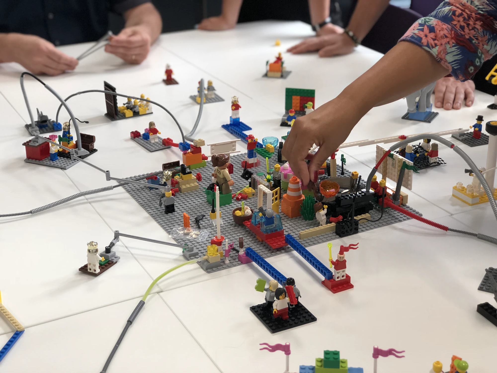

## IoC(Inversion of Control), DI(Dependency Injection)

<div align='center'>
    
</div>

- IoC나 DI는 레고와 같은 것이다
  - 스프링이 바닥판처럼 깔려있고, 우리는 그 위에서 멋진 조립(어플리케이션)을 만들면 된다

### DI(의존성 주입)
전통적인 프로그래밍 모델에서는 `객체가 자신의 의존성을 생성하고 관리`한다. 

간단한 예로
```java
public class 청룡언월도 {
    ...
    ...
}
```
```java
public class 관우 {
    private 청룔언월도 언월도=new 청룡언월도();

    public 관우() {
        언월도 = new 청룡언월도();
    }
}
```
이런식으로 `관우 클래스 내부에서 청룡언월도 객체를 생성`했기떄문에 이것은 의존성 주입이아니라
`스스로 의존성을 만든것`이다

하지만 의존성 주입을 적용할 경우

```java
@Component // 스프링 컨테이너에 Bean으로 등록
public class 청룔언월도 {
    ...
    ...
}
```
```java
public class 관우 {
  @Autowired // 스프링 컨테이너에 있는 청룡언월도 타입의 Bean을 주입
  private 청룔언월도 언월도;
}

```
위 코드에 경우 청룡언월도 `객체(Bean)를 스프링 컨테이너에 등록`하고, 스프링 컨테이너에서 관우의 언월도 멤버변수에
`Bean객체를 주입`할 수 있게 해준 것이다.

### IoC(제어의 역전)

스프링에서 우리는 객체의 의존성을 제어의 역전이라는 개념을 통해 주입 받을 수 있다.

IoC에 의미는 다음과 같다.
>스프링 컨테이너가 필요에 따라 개발자 대신 Bean들을 관리(제어)해주는 행위

즉 개발자가 객체들을 제어하는게 아니라, 스프링 컨테이너(IoC container)에서 객체들을 등록하고 제어해주는 것이다.

덕분에 우리는 마치 레고 조립과 같이, 스프링이 기반을 제공하고 개발자는 그 위에 자신의 독특한 애플리케이션을 
조립하면서 비즈니스 로직에만 집중할 수 있게 되는 것이다.

### IoC Container(스프링 컨테이너)

> 스프링 프레임워크에서 객체를 Bean객체로서 등록하고 의존성을 관리해주는 컨테이너

IoC 컨테이너는 객체의 생성을 책임지고, 의존성을 관리한다. 또한 
생성부터 소멸까지의 LifeCycle(생명주기)를 관리한다.

개발자들이 직접 객체를 생성할 수도 있지만 컨테이너에게 맡긴다. 이렇게 맡김으로서 개발자들은 비즈니스 로직에 더욱 집중할 수 있게 된다.

Spring Container는 크게  `BeanFactory`와 `Application Context` 로 나뉜다

#### BeanFactory

Spring의 `가장 기본적인 IoC 컨테이너 인터페이스`로, Bean의 생성, 설정, 조회, 관리 등의 기본적인 기능을 제공한다.

하지만 `메세지 처리`나 `실행환경 관리`같은 고급 기능은 제공하지 않는다.

```java
//
// Source code recreated from a .class file by IntelliJ IDEA
// (powered by FernFlower decompiler)
//

package org.springframework.beans.factory;

import org.springframework.beans.BeansException;
import org.springframework.core.ResolvableType;
import org.springframework.lang.Nullable;

public interface BeanFactory {
    String FACTORY_BEAN_PREFIX = "&";

    Object getBean(String name) throws BeansException;

    <T> T getBean(String name, Class<T> requiredType) throws BeansException;

    Object getBean(String name, Object... args) throws BeansException;

    <T> T getBean(Class<T> requiredType) throws BeansException;

    <T> T getBean(Class<T> requiredType, Object... args) throws BeansException;

    <T> ObjectProvider<T> getBeanProvider(Class<T> requiredType);

    <T> ObjectProvider<T> getBeanProvider(ResolvableType requiredType);

    boolean containsBean(String name);

    boolean isSingleton(String name) throws NoSuchBeanDefinitionException;

    boolean isPrototype(String name) throws NoSuchBeanDefinitionException;

    boolean isTypeMatch(String name, ResolvableType typeToMatch) throws NoSuchBeanDefinitionException;

    boolean isTypeMatch(String name, Class<?> typeToMatch) throws NoSuchBeanDefinitionException;

    @Nullable
    Class<?> getType(String name) throws NoSuchBeanDefinitionException;

    @Nullable
    Class<?> getType(String name, boolean allowFactoryBeanInit) throws NoSuchBeanDefinitionException;

    String[] getAliases(String name);
}

```
내부 함수들을 살펴보면 `Bean객체를 가져오거나`, 해당 이름의 `Bean이 등록되어있는지 확인`하거나, `Scope가 싱글톤인지, 프로토타입인지 확인`하는 함수들이 있음을 알 수 있다.

#### ApplicationContext

ApplicationContext는 `BeanFactory를 확장한 인터페이스`이다.

어플리케이션 컨텍스트는 `메시지 처리`, `환경변수(프로파일) 관리`, `애플리케이션 레벨의 리소스 로딩`과 같은 추가적인 기능을 제공한다.

```java

package org.springframework.context;

import org.springframework.beans.factory.HierarchicalBeanFactory;
import org.springframework.beans.factory.ListableBeanFactory;
import org.springframework.beans.factory.config.AutowireCapableBeanFactory;
import org.springframework.core.env.EnvironmentCapable;
import org.springframework.core.io.support.ResourcePatternResolver;
import org.springframework.lang.Nullable;

public interface ApplicationContext extends EnvironmentCapable, ListableBeanFactory, HierarchicalBeanFactory, MessageSource, ApplicationEventPublisher, ResourcePatternResolver {
  @Nullable
  String getId();

  String getApplicationName();

  String getDisplayName();

  long getStartupDate();

  @Nullable
  ApplicationContext getParent();

  AutowireCapableBeanFactory getAutowireCapableBeanFactory() throws IllegalStateException;
}

```
ApplicationContext가 상속받은 인터페이스들을 하나식 살펴보자.

- **ListableBeanFactory**:  BeanFactory를 확장한 인터페이스로 `빈들의 전체 목록을 조회`하거나, 특정 타입에 맞는 `빈들을 리스트로서 검색하는 기능을 제공`한다. <br> 이는 `애플리케이션 레벨에서 빈의 관리 및 접근`을 가능하게 해준다 


- **EnvironmentCapable**: 해당 인터페이스에 getEnvironment() 메서드를 통해 `실행환경(프로파일)에 접근 및 관리` 할수 있다


- **HierarchicalBeanFactory**: 빈 팩토리의 계층 구조를 관리한다. 즉, 부모 컨텍스트에서 빈을 참조할 수 있게 해주며, 이는 `확장된 의존성 관리`를 가능하게 한다.


- **MessageSource**: 국제화(i18n) 기능을 제공하는 인터페이스이다. 다양한 `언어와 지역 설정에 맞는 메시지를 로드하고 관리`할 수 있게 해준다. 이는 애플리케이션에서 메시지 처리와 직접적으로 관련 있다.


- **ApplicationEventPublisher**: 이벤트 발행 기능을 제공하여, `애플리케이션 내에서 발생하는 다양한 이벤트를 관리하고 전파`할 수 있다. 이는 애플리케이션의 상호작용과 동적인 반응을 가능하게 한다


- **ResourcePatternResolver**: 소스 로딩 기능을 제공하는 인터페이스이다. 파일 시스템이나 클래스패스, 외부 URL 등에서 `리소스 패턴을 해석하여 리소스를 로드`할 수 있게 해준다.

따라서 우리는,
ApplicationContext가 `BeanFactory를 확장한 인터페이스`이고,

`BeanFactory의 기본적인 기능`과 `실행환경에 접근 및 관리`, `메시지 처리`, `이벤트 발행`, `리소스 로딩`과 같은 추가적인 기능을 제공함을 확인할 수 있었다.


#### BeanFactory VS ApplicationContext

앞서 살펴 보았듯이 ApplicationContext는 BeanFactory의 모든 기능을 포함하고 여러 추가 기능들을 제공해주기 떄문에

이 추가기능들을 사용하는 것보다 메모리 소모량 축소가 더욱 중요한 상황이 아니라면 ApplicationContext를 사용하는것이 더 좋아보인다.


<br><br><br>
틀린 점 있을시 마음껏 비판, 충고, 조언 해주시길 바랍니다
