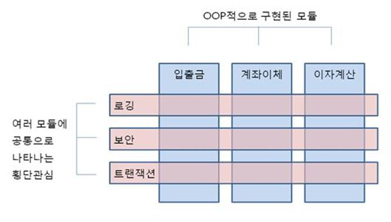
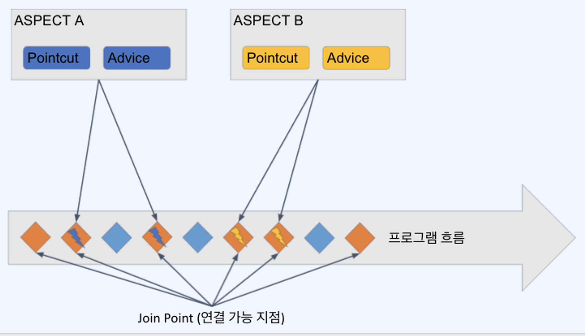

## 관점 지향 프로그래밍 - Aspect Oriented Programming(AOP)

- 특정한 함수 호출 전이나 후에 뭔가 공통적인 처리가 필요하다면!? → AOP
    - 로깅
    - 트랜잭션
    - 인증


- OOP로 처리하기에는 다소 까다로운 부분을 AOP라는 처리 방식을 도입하여 손쉽게 `공통 기능을 추가/수정/삭제 할 수 있도록 함`
=> 즉 , `AOP는 기존의 객체 지향 프로그래밍(OOP)의 보완으로 사용`되어, OOP에서 어려울 수 있는 `일련의 공통 기능(횡단 관심사)의 관리`를 용이하게 합니다.

## 횡단 관심사

횡단관심사(Cross-cutting concerns)란 소프트웨어 개발에서 주요 비즈니스 로직을 넘나드는, `여러 곳에 걸쳐서 나타나는 관심사`를 말한다.

이러한 관심사들은 일반적인 비즈니스 로직과는 별개로, `여러 컴포넌트나 계층에서 반복적으로 발생`하는 기능이나 요구사항을 포함한다

객체 지향 프로그래밍(OOP)에서는 이러한 횡단 관심사를 관리하기 어려울 수 있다

<div align='center'>
    
</div>


## 횡단 관심사의 예시

**로깅**: 시스템의 다양한 부분에서 수행되는 동작을 기록하는 로깅 코드는 여러 클래스나 메서드에 걸쳐 필요할 수 있다.

**보안**: 인증이나 권한 검사와 같은 보안 메커니즘이 애플리케이션의 많은 부분에서 요구될 수 있다.

**트랜잭션 관리**: 데이터베이스 작업을 수행할 때 트랜잭션을 시작하고 종료하는 로직이 다양한 비즈니스 메서드에서 요구될 수 있다.

**오류 처리**: 오류 처리 로직은 여러 함수나 클래스에서 반복적으로 사용될 수 있다.

음... 그런데 `로깅은 LogBack`으로, `보안은 Spring Security 필터체인`으로, `트랜잭션은  @Transaction`으로(사실 트랜잭션 어노테이션이 내부적으로는 AOP기반이다),
`오류처리는 @ControllerAdivce`로 전역 예외처리를 하지않나...?

AOP구현해서 사용할 일이 있나..?

구현은 할줄 아는 상태지만, 적극적으로 활용해본적은 없어서 잘 모르겠다. 

필자가 생각하기엔 `로깅, 보안, 오류처리같은 횡단 관심사`는 어플리케이션을 구현한다고 하면 `필수적으로 고려하는 관심사`라서, 각 관심마다 강력한 `기능을
스프링에서 제공`해주는 것인거 같다.

따라서 저런 대표적인 횡단 관심사말고도, 

1. 추가적인 횡단 관심사가 생겼는데,

2. 따로 스프링단에서 제공하는 강력한 기능이 없으면

AOP를 이용해 공통로직으로 구현하면 좋을거 같다.


## AOP의 기본 개념들

### Aspect

여러 클래스나 기능에 걸쳐서 있는 관심사, 그리고 그것들을 모듈화함

AOP 중에서 가장 많이 활용되는 부분은 @Transactional (트랜잭션 관리) 기능

### Advice

조언, AOP에서 실제로 적용하는 기능(로깅, 트랜잭션, 인증 등)을 뜻함

### Join point

모듈화된 특정 기능이 실행될 수 있는 연결 포인트

### Pointcut

Join point 중에서 해당 Aspect를 적용할 대상을 뽑을 조건식

### Target Object

Advice가 적용될 대상 오브젝트

### AOP Proxy

대상 오브젝트에 Aspect를 적용하는 경우 Advice를 덧붙이기 위해 하는 작업을 AOP Proxy라고 함

주로 CGLIB(Code Generation Library, 실행 중에 실시간으로 코드를 생성하는 라이브러리) 프록시를 사용하여 프록싱 처리를 한다.

### Weaving

Advice를 비즈니스 로직 코드에 삽입하는 것을 말함

<div align='center'>
    
</div>


## AspectJ 

AspectJ는 AOP를 제대로 사용하기 위해 꼭 필요한 라이브러리이다

기본적으로 제공되는 Spring AOP보다 더 다양한 포인트컷과, `바이트 코드 위빙`을 지원한다.

### Spring AOP vs AspectJ

| **특징**                        | **Spring AOP**                                | **AspectJ**                                   |
|---------------------------------|-----------------------------------------------|-----------------------------------------------|
| **AOP 구현 방식**               | 프록시 기반                                    | 바이트코드 위빙 (컴파일 타임, 로드 타임, 런타임) |
| **포인트컷 표현식**             | 제한된 포인트컷 표현식 지원                    | 매우 풍부한 포인트컷 표현식 지원               |
| **지원되는 조인 포인트**        | 메서드 호출                                   | 메서드 호출, 필드 접근, 객체 생성 등 다양한 조인 포인트 지원 |
| **위빙 시점**                   | 런타임                                        | 컴파일 타임, 로드 타임, 런타임 모두 지원         |
| **성능**                        | 런타임 오버헤드가 있을 수 있음                 | 컴파일 타임 및 로드 타임 위빙으로 런타임 오버헤드 최소화 가능 |
| **설정의 용이성**               | Spring 프레임워크와 통합이 용이                | 설정이 다소 복잡할 수 있음                      |
| **의존성 관리**                 | Spring AOP 라이브러리에 의존                   | AspectJ 라이브러리 및 위빙 설정 필요            |
| **학습 곡선**                   | 비교적 완만함                                  | 비교적 가파름                                   |
| **전반적 복잡성**               | 단순한 경우에 적합                             | 복잡한 AOP 요구사항에 적합                      |
| **타깃 플랫폼**                 | 주로 Spring 프레임워크 환경                    | Java 전반에 걸쳐 사용 가능                      |


### AspectJ를 활용한 AOP구현

####  Aspect 생성
먼저, Aspect를 생성한다. 이 Aspect는 스프링의 빈으로 등록하기 위해 @Component 애너테이션을 사용한다.
```java
package com.example.aspect;
import org.aspectj.lang.annotation.Aspect;
import org.springframework.stereotype.Component;

@Aspect
@Component
public class UsefulAspect {

}
```
####  Pointcut 선언
해당 Aspect의 Advice(실행할 액션)이 적용될 Join point를 찾기 위한 패턴 또는 조건 생성

포인트 컷 표현식이라고 부름
```java
package com.example.aspect;

import org.aspectj.lang.annotation.Aspect;
import org.aspectj.lang.annotation.Pointcut;
import org.springframework.stereotype.Component;

@Aspect
@Component
public class UsefulAspect {


  /*  
    execution(* transfer(..)) 를 하나식 뜯어서 해석하자면,
    * => 반환 타입이 무엇이든 ,
    transfer => 메서드 이름이 transfer이고,
    (..) => 파라미터의 개수나 타입에 상관없이
    execution () => 메서드가 실행될떄 
  */
  
  //즉, 메서드명이 transfer인 모든 메서드가 실행될떄마다 Advice가 적용되는 포인트컷을 선언한 것임
    @Pointcut("execution(* transfer(..))")
    private void anyOldTransfer() {}
}
```
<h4 id="section1">Pointcut 결합</h4>

여러 포인트컷을 결합하여 복잡한 조건도 정의 가능
```java
package org.xyz;
import org.aspectj.lang.annotation.Aspect;

@Aspect
@Component  
public class UsefulAspect {

	@Pointcut("execution(public * *(..))")
	private void anyPublicOperation() {} //public 메서드 대상 포인트 컷

	@Pointcut("within(com.xyz.myapp.trading..*)")
	private void inTrading() {} // 특정 패키지 대상 포인트 컷
	
	@Pointcut("anyPublicOperation() && inTrading()")
	private void tradingOperation() {} // 위의 두 조건을 and(&&) 조건으로 결합한 포인트 컷
}
```

#### Advice 정의

포인트컷들을 활용하여 포인트컷의 전/후/주변에서 실행될 액션을 정의함

이떄 포인트컷은
- 직접 **포인트컷 표현식을 즉석에서 선언**해서 사용할수 있다.
```java
@AfterReturning(pointcut = "execution(* com.example.service.*.*(..))")
public void afterReturningAdvice() {
  System.out.println("조인포인트 종료된 뒤에 이거 출력됨!");
}
```
이때 `pointcut = "execution(* com.example.service.*.*(..))"` 라고 바로 포인트컷을 선언했다.

즉 com.example.service 패키지안에 모든 클래스들의 모든 메서드의 실행을 Pointcut으로 사용하겠단 의미이다.

-  **@PointCut어노테이션으로 정의한 포인트컷**을 사용해도 된다.


```java
import org.aspectj.lang.annotation.AfterReturning;
import org.aspectj.lang.annotation.Aspect;
import org.springframework.stereotype.Component;

@Aspect
@Component
public class AfterReturningAdviceExample {

  @AfterReturning(pointcut = "org.xyz.UsefulAspect.anyPublicOperation()")
  public void afterReturningAdvice() {
    System.out.println("조인포인트 종료된 뒤에 이거 출력됨!");
  }
}
```
`org.xyz.UsefulAspect.anyPublicOperation()` 포인트컷 선언부분은 [Pointcut 결합](#section1) 코드부분에 있다
### Advice 메서드의 실행시점

Adivce메서드는 조인포인트(join point) 실행 전/후 또는 전과 후에 실행될 수 있다.

- **@Before** :  조인 포인트(join point) 실행 전에 실행된다.


- **@AfterReturning** : 조인 포인트가 정상적으로 종료된 후(예외 없이) 실행된다.


- **@AfterThrowing** : 조인 포인트에서 예외가 발생한 후에 실행된다.


- **@After** : 조인 포인트가 정상적으로 종료되든, 예외를 던지든 상관없이 실행된다. 조인 포인트 실행 후 반드시 실행되야하는 작업 수행할떄 사용.


- **@Around** :  조인 포인트의 전후에 실행된다.


### Adivice 어노테이션에 속성들


- **pointcut**: 어드바이스가 적용될 포인트컷을 지정한다


- **returning**: 조인포인트 메서드가 정상적으로 반환한 값을 어드바이스 메서드의 매개변수로 전달한다


- **throwing**: 조인포인트 메서드에서 던진 예외를 어드바이스 메서드의 매개변수로 전달한다

### 예시
```java
@AfterReturning(pointcut = "execution(* com.example.service.*.*(..))", returning = "result")
public void afterReturningAdvice(Object result) {
    System.out.println("After method returning with result: " + result);
}
```
위 경우 com.example.service 패키지안에

임의클래스 A의 a라는 메서드가 실행되었다고 가정하자.

이떄 `a메서드의 리턴값이 15`일경우,

15를 **afterReturningAdvice**라는 Advice 메서드의 `result라는 매개변수로 전달`한다는 의미이다.

이떄 당연히, **afterReturningAdvice** 메서드의 매개변수인 `Object result`와 어노테이션 속성값인 `returning = "result"` 는 변수명이 일치해야한다.

(지금은 "result" 로 일치함을 알 수 있다.)


<br><br><br>
틀린 점 있을시 마음껏 비판, 충고, 조언 해주시길 바랍니다
