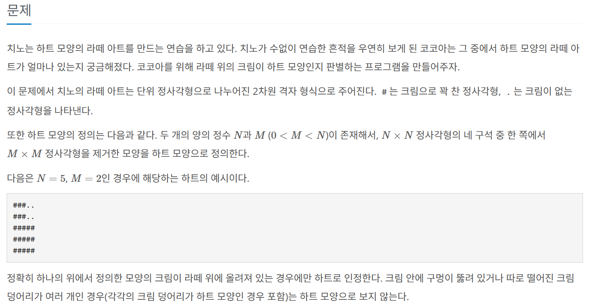
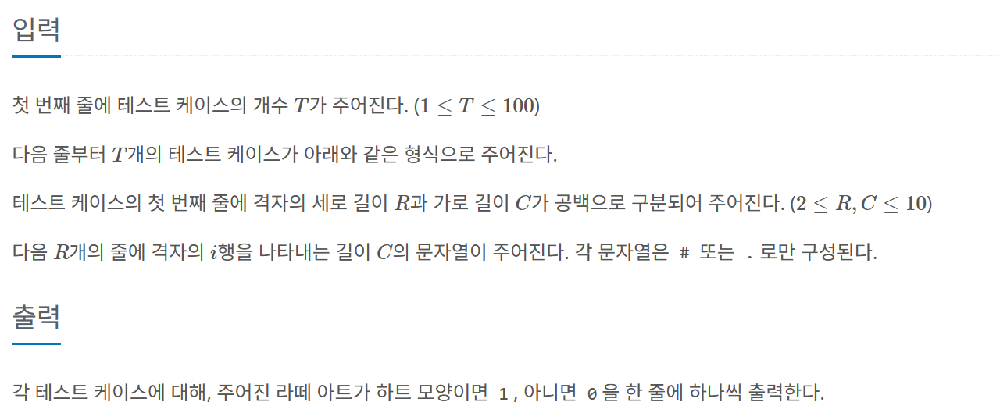

## 문제 

<div align='center'>
    
</div>

## 입력과 출력 양식

<div align='center'>
    
</div>

## 예제 입력과 출력

### 예제 입력

```text
3
5 5
###..
###..
#####
#####
#####
10 10
...#.#....
..#.#.#...
..#.#.#...
..#####...
.#.....#..
.#.#.#.#..
.#..#..#..
.#.###.#..
.#.....#..
..#####...
4 8
........
.##.....
.#......
........
```

### 예제 출력 
```text
1
0
1
```

## 코드 

```java
     import java.util.*;
     import java.io.*;
     public class Main {
     public static void main(String[] args) throws IOException{
         BufferedReader bf=new BufferedReader(new InputStreamReader(System.in));
         List<Integer> answer=new ArrayList<>();
         //테스트 케이스 수
         int trial =Integer.parseInt(bf.readLine());

         for (int i = 0; i < trial; i++) {
             String[] rowAndColumn = bf.readLine().split(" ");
             //각 테케의 row, column 갯수
             int row= Integer.parseInt(rowAndColumn[0]);
             int column= Integer.parseInt(rowAndColumn[1]);
             // 격자판을 저장할 배열             
             char[][] grid = new char[row][column]; 
             // 격자판에 존재하는 크림의 갯수
             int creamCnt=0;
             //크림의 x,y좌표의 양끝값 초기화 
             int maxCreamX=-1, minCreamX=11,maxCreamY=-1,minCreamY=11; 

             // 격자판 데이터 입력 받기
             for (int r = 0; r < row; r++) {
                 String line = bf.readLine();

                 for (int c = 0; c < column; c++) {
                     grid[r][c] = line.charAt(c);
                     if(grid[r][c] =='#'){
                         maxCreamX=Math.max(maxCreamX,c);
                         minCreamX=Math.min(minCreamX,c);
                         maxCreamY=Math.max(maxCreamY,r);
                         minCreamY=Math.min(minCreamY, r);
                         creamCnt+=1;
                     }
                 }
             }

             //주어진 조건에 따라 최소 크림수는 2이상이여야 한다.
             if(creamCnt<=2){
                 answer.add(0);
                 continue;
             }

             //크림이 정사각형인지 확인
             int creamLenX=maxCreamX-minCreamX+1;
             int creamLenY=maxCreamY-minCreamY+1;
             if(creamLenX!=creamLenY){
                 answer.add(0);
                 continue;
             }
             // 정사각형 크림범위 안에서의 빈공간의 갯수 
             int nullCnt=0;
             int maxNullX=-1, minNullX=11,maxNullY=-1,minNullY=11;

             //정사각형의 크림 범위 안에서 빈공간의 갯수랑 빈공간의 x,y의 최대,최소값을 구함
             for (int r = minCreamY; r <= maxCreamY; r++) {
                 for(int c=minCreamX;c<=maxCreamX;c++){
                 if(grid[r][c] =='.'){
                     maxNullX=Math.max(maxNullX,c);
                     minNullX=Math.min(minNullX,c);
                     maxNullY=Math.max(maxNullY,r);
                     minNullY=Math.min(minNullY, r);
                     nullCnt+=1;
                 }
             }
         }

             //빈공간의 꼭짓점과 정사각혐 크림의 꼭짓점이 일치하는 좌표가 반드시 존재해야함
             boolean isCorner1=(maxCreamX==maxNullX && maxCreamY==maxNullY);
             boolean isCorner2=(maxCreamX==maxNullX && minCreamY==minNullY);
             boolean isCorner3=(minCreamX==minNullX && maxCreamY==maxNullY);
             boolean isCorner4=(minCreamX==minNullX && minCreamY==minNullY);
             if(!(isCorner1 || isCorner2 || isCorner3 || isCorner4)){
                 answer.add(0);
                 continue;
             }

             //빈공간이 정사각형인지확인
             int NullLenX=maxNullX-minNullX+1; int NullLenY=maxNullY-minNullY+1;
             if(NullLenX!=NullLenY){
                 answer.add(0);
                 continue;
             }
             
             //정사각형 크림안의 카운트한 빈공간의 갯수와 정사각형 빈공간의 넓이는 같아야한다.
             if(nullCnt!=Math.pow(NullLenX,2)){
                 answer.add(0);
                 continue;
             }

             // 크림정사각형-빈정사각형=크림개수인지확인
             int cnt=(int)(Math.pow(creamLenX,2)-Math.pow(NullLenX,2));
             if(cnt!=creamCnt){
                 answer.add(0);
                 continue;
             }
             
             //여기까지 조건식을 통과했다면, 라떼 모양으로 인정됨
             answer.add(1);

        }
         //요구하는 출력방식을 출력
        for(int ans:answer){
         System.out.println(ans);
        }
 	}
 }
```


## 설명

따져야할 조건이 많은, 예민한 문제인거 같다.

적용해야 될 조건을 하나식 적용해가며, 모든 조건을 만족했을때 라떼모양임을 증명하는 방식으로 코드를 구현했다.

우선 기본 조건이 0<M<N에서, N의 최솟값은 2 이므로 2X2=4 에서 1X1=1 빈공간을 뺀 `최소 3개의 크림은 반드시 존재`해야 하므로

크림 갯수가 2 이하인지 확인한다.

그런 다음, `크림이 정사각형 모양이 존재하는지 확인`한다. 크림의 최대 가로, 세로 길이가 같으면 크림은 정사각형모양이다.

그리고 이떄 격자판에 존자하는 `모든 크림 수를 카운트`한다. 나중에 크림모양에 중간에 구멍이있는지 확인하기 위해서이다.

그런 다음, 정사각형 크림 안에 `빈공간의 x,y의 최대,최소 좌표`들을 구하고, 정사각형 크림 안에 `빈공간의 갯수`도 카운트한다.

이제 앞으로 언급되는 `빈공간은 항상 정사각형 크림안의 빈공간`을 의미한다고 생각하자. 

(왜냐면 정사각형 크림안에 존재하지 않는 빈공간은 아무런 의미가 없기 떄문이다.)

빈공간의 x, y 좌표들의 최소, 최대값과 크림의 x, y 좌표들의 최소,최대값을 알고있으므로, 이제 `정사각형크림의 꼭짓점과 빈공간의 꼭짓점이 일치하는 부분`이 있는지 확인할 수 있다.

이제 `빈공간이 정사각형 모양인지 확인`한다.

여기까지 왔으면, 정사각형 크림안에 정사각형 빈공간이 있는 상태이고, 어느 한 꼭짓점을 공유하고 있는 상태이다.

이제 앞서 구한 `빈공간의 카운트수`와 `빈공간의 정사각형의 넓이`가 같은지 확인한다.

최종적으로, 정사각형 크림 넓이 - 빈공간의 카운트 수 == 크림의 카운트 수인지 확인해서 `크림모양 사이에 구멍`이 있는지 확인한다

여기까지 오면서 `모든 조건을 만족`했다면, `라떼 모양`이 반드시 맞음을 알 수 있다.

