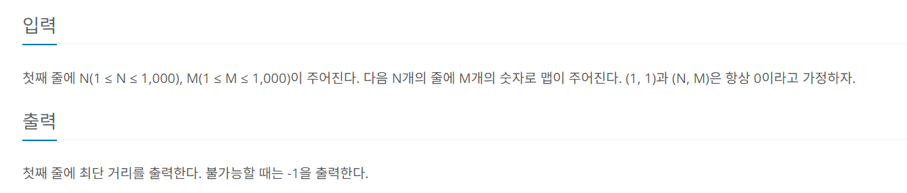

## 문제

<div align='center'>
    
</div>

## 입력과 출력 양식

<div align='center'>
    
</div>

## 예제 입력과 출력

### 예제 1

#### 입력
```text
6 4
0100
1110
1000
0000
0111
0000
```
#### 출력

```text
15
```


### 예제 2

#### 입력
```text
4 4
0111
1111
1111
1110
```
#### 출력

```text
-1
```
## 코드
```java
import java.util.*;
import java.io.*;
class Main {
  public static void main(String[] args) throws IOException {

    BufferedReader bf = new BufferedReader(new InputStreamReader(System.in));

    String[] rowAndColumn = bf.readLine().split(" ");
    int row = Integer.parseInt(rowAndColumn[0]);
    int column = Integer.parseInt(rowAndColumn[1]);
    int[][] grid = new int[row][column]; // 격자판을 저장할 배열
    //일반적인 방문여부 변수와는 다르게 벽을 부쉈는지(1) 안 부쉈는지(0)를 추가하여 3차원 배열로선언
    boolean[][][] visited = new boolean[row][column][2];

    // 격자판 데이터 입력 받기
    for (int r = 0; r < row; r++) {
      String line = bf.readLine();
      for (int c = 0; c < column; c++) {
        grid[r][c] = Character.getNumericValue(line.charAt(c));
      }
    }

    int result = bfs(row, column, grid, visited);
    System.out.println(result);

  }

  static int[][] direction = { {0, 1}, {1, 0}, {0, -1}, {-1, 0} };

  public static int bfs(int row, int column, int map[][], boolean[][][] visited) {
    Queue<int[]> queue = new LinkedList<>();
    // 배열의 각 요소의 의미는 x좌표, y좌표 ,이동 거리, 벽을 부수고 왔는지 확인
    // 부쉈으면 1, 안 부쉈다면 0이다. 처음 시작 좌표 0,0 에서는 아직 안부쉈으므로 0으로 선언했다.
    queue.add(new int[]{0,0,1,0});

    visited[0][0][0] = true; //x,y,부순경로인지아닌지 (0이 안부순거, 1이 부순거)

    while (!queue.isEmpty()) {
      int[]  current = queue.poll();
      int  x = current[0];
      int   y = current[1];
      int    distance = current[2];
      int   isBroken=current[3];

      if (x == row - 1 && y == column - 1) {
        return distance;

      }

      for (int[] dir : direction) {
        int newX = x + dir[0];
        int newY = y + dir[1];
        //일단 2차원 격자판안에서 좌표들이 존재하는지 확인
        if(!(newX>=0 && newX<row && newY>=0 && newY<column)){continue;}
        if(visited[newX][newY][isBroken]){
          continue;
        }
        //아직 벽안부쉈고, 지금 탐색할 곳이 벽일 경우
        if( isBroken==0 && map[newX][newY]==1) {
          queue.add(new int[]{newX,newY,distance+1,1});
          visited[newX][newY][1]=true;
        }
        //벽 부쉈고, 지금 탁샐할 곳이 벽일경우
        else if(isBroken==1 && map[newX][newY]==1){}
        
        //나머지일 경우일 경우
        else{
          queue.add(new int[]{newX,newY,distance+1,isBroken});
          visited[newX][newY][isBroken]=true;
        }

      }

    }
    // 큐가 다비워졌는데도, 즉 가능한 모든 탐색을 했는데도 중간에 정답이 안나왔으면
    // 갈수가 없으므로 -1 리턴
    return -1;
  }
}
```

## 설명

평범한 최단거리를 찾는문제에서, 벽이 존재하며 1 번만 부술수 있다는 조건이 생긴 문제이다.


추가 예정
