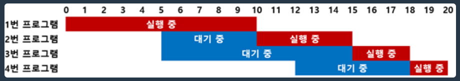
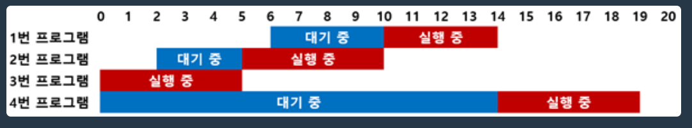

## 문제
[프로그래머스 운영체제](https://school.programmers.co.kr/learn/courses/15008/15008-pccp-%EB%AA%A8%EC%9D%98%EA%B3%A0%EC%82%AC-1%ED%9A%8C)

개발자 준모는 운영체제를 만들었습니다. 준모가 만든 운영체제는 프로그램의 우선순위와 호출된 시각에 따라 실행 순서를 결정합니다. 모든 프로그램에는 1부터 10까지의 점수가 매겨져 있으며, 이 점수가 낮을수록 우선순위가 높은 프로그램입니다. 각 프로그램들은 실행 시간이 정해져 있으며 프로그램이 호출되면 대기상태에 있다가 자신의 순서가 되면 실행 시간 동안 실행된 뒤 종료됩니다.

준모가 만든 운영체제는 호출된 프로그램들 중 우선순위가 가장 높은 프로그램을 먼저 실행합니다. 호출된 각 프로그램은 자신보다 우선순위가 높은 호출된 프로그램이 모두 종료된 후에 실행됩니다. 단, 실행 중인 프로그램보다 우선순위가 높은 프로그램이 호출되어도 실행 중이던 프로그램은 중단되지 않고 종료될 때까지 계속 실행됩니다. 또한, 우선순위가 같은 프로그램들 중에서는 먼저 호출된 프로그램이 먼저 실행됩니다.

다음은 1번부터 4번까지의 4개의 프로그램이 호출된 예시입니다.

<div align='center'>
    
</div>

예를 들어, 1번부터 4번까지 4개의 프로그램의 점수가 순서대로 2, 1, 3, 3이며, 호출된 시각은 0, 5, 5, 12초이고, 수행시간은 10, 5, 3, 2라고 가정해 봅시다.

1. 1번 프로그램이 0초에 호출될 때 실행 중인 프로그램이 없으므로, 0초에 1번 프로그램이 바로 실행됩니다. 1번 프로그램은 10초에 종료되며, 2, 3번 프로그램이 새로 호출됩니다. <br><br>
2. 호출된 2, 3번 프로그램 중 2번 프로그램의 점수가 1로 우선순위가 높습니다. 2번 프로그램은 5초에 실행되어 10초에 종료될 때까지 5초 동안 대기했습니다. 2번 프로그램은 15초에 종료되며, 4번 프로그램이 새로 호출됩니다.<br><br>
3. 호출된 3, 4번 프로그램은 점수가 같지만, 3번 프로그램이 먼저 호출되었기 때문에 3번 프로그램이 먼저 실행됩니다. 3번 프로그램은 5초에 호출되어 15초에 실행될 때까지 10초 동안 대기했습니다. 3번 프로그램은 18초에 종료됩니다.<br><br>
4. 4번 프로그램이 마지막으로 실행되며, 4번 프로그램은 12초에 실행되어 18초에 종료될 때까지 6초 동안 대기했습니다. 4번 프로그램은 20초에 종료됩니다.

모든 프로그램이 종료되는 시각은 20초이며, 각 프로그램에 대기한 시간은 순서대로 0, 5, 10, 6초입니다. 점수가 1인 프로그램의 대기시간 합은 5초, 점수가 3인 프로그램의 대기시간 합은 16초 임을 알 수 있습니다.

프로그램들의 정보를 나타내는 2차원 정수 배열 `program`이 주어질 때, 모든 프로그램들이 종료되는 시각과 프로그램의 점수마다 대기시간의 합을 정수 배열에 담아 return 하는 solution 함수를 완성하세요. 

return 해야 하는 `answer` 배열은 길이가 11인 정수 배열입니다. `answer[0]`은 모든 프로그램들이 종료되는 시각을 의미하며, `answer[i]`(1 ≤ i ≤ 10)는 프로그램의 점수가 i인 프로그램들의 대기시간의 합을 의미합니다.

## 제한사항

- 1 ≤ `program` 의 길이 ≤ 100,000
- `program[i]` 은 i+1번 프로그램의 정보를 의미하며, `[a, b, c]`의 형태로 주어집니다.
  - a는 프로그램의 점수를 의미하며, 1 ≤ a ≤ 10 을 만족합니다.
  - b는 프로그램이 호출된 시각을 의미하며, 0 ≤ b ≤ 10,000,000을 만족합니다.
  - c는 프로그램의 실행 시간을 의미하며, 1 ≤ c ≤ 1,000을 만족합니다.
  - a, b쌍이 중복되는 프로그램은 입력으로 주어지지 않습니다. 즉, 호출된 시각이 같으면서 점수도 같은 프로그램은 없습니다.


## 입출력 예


| program                          | result(answer)                        |
|----------------------------------|---------------------------------------|
| [[2, 0, 10], [1, 5, 5], [3, 5, 3], [3, 12, 2]] | [20, 5, 0, 16, 0, 0, 0, 0, 0, 0, 0] |
| [[3, 6, 4], [4, 2, 5], [1, 0, 5], [5, 0, 5]]   | [19, 0, 0, 4, 3, 14, 0, 0, 0, 0, 0] |


## 입출력 예 설명

입출력 예 #1
- 문제 예시와 같습니다.

입출력 예 #2
- 그림으로 나타내면 아래 그림과 같습니다.

<div align='center'>
    
</div>

## 풀이

```python
import heapq
from collections import *

# 우선순위 큐(파이썬에는 내부적으로 최소힙으로 구현)를 활용해 시간복잡도 줄일것임 (삽입, 삭제 모두 logN)
def check_program_and_push_waiting(program,waiting,finish):
  #프로그램안에 값이 존재한다면 그중 waiting에 넣을껄 조사한다.
  while program and program[0][1] <= finish:
    # waiting에 추가한다.
    heapq.heappush(waiting,program.popleft())

  #프로그램안에 값이 존재하고 waiting이 비어있으면
  if program and not waiting:
    be_pushed=program.popleft()
    # program의 제일 앞에꺼를 빼서 넣는다
    heapq.heappush(waiting,be_pushed)
    #finish를 해당 프로그램 실행 종료까지로 옮긴다.
    finish=be_pushed[1]

  return program,waiting,finish

def solution(program):
  #정답 변수 선언
  answer = []
  #정답 출력을 위한 리스트
  answer_list = [0 for i in range(11)]
  #프로그램을 double ended queue로 만들고 정렬
  program.sort(key=lambda x: (x[1], x[0]))
  program=deque(program)

  #대기중인 프로그램을 위한 변수 선언
  waiting = []
  first=program.popleft()
  # 종료시간을 위한 변수 선언
  finish = first[1]+first[2]
  #우선 처음한번 함수를 돌려서 waiting에 추가
  program, waiting ,finish= check_program_and_push_waiting(program, waiting, finish)
  # wating이 없을때까지 반복
  while waiting:
    # waiting에서 우선순위에 따라 뺴고
    wait = heapq.heappop(waiting)
    # 대기시간 계산해서
    wait_time = finish - wait[1]
    # 정답에 추가하고
    answer_list[wait[0]] += wait_time
    # finish를 갱신한다
    finish += wait[2]
    #finish가 갱신되었으니 대기중인 프로그램 추가
    program,waiting,finish=check_program_and_push_waiting(program,waiting,finish)


  answer=[finish]+answer_list[1:]

  return answer
```

## 설명
처음에는 우선순위를 커스텀해서 **우선순위 큐를 이용하면 되겠다고 생각**했다.

그러나 잘 생각해보면 굳이 커스텀할 필요 없이, **파이썬에서 제공되는 heapq를 사용하면 빠르게 구현이 가능**했다.

우선 **파이썬의 heapq는 최소힙으로 구현한 우선순위 큐**로서 사용가능하고,

그 기준은 iterable한 객체일 경우, **첫번쨰 인덱스의 값부터 시작해서 마지막 인덱스의 값까지 비교**하는데,

각 **인덱스 값의 오름차순으로 우선순위**가 높다.

즉 [0,2,3] 과 [0,2,5] 일 경우, 첫번쨰 값과 두번쨰 값은 각각 0, 2로 동일하지만,

세번쨰 값이 3이 5보다 작으므로 [0,2,3]이 우선순위가 더 높으므로 pop을 할경우 해당 값이 나온다.

이 문제에 경우, 대기하고 있는 프로그램의 우선순위는 다음과 같다.

1. [번호, 호출시각, 걸리는시간] 중 **번호가 낮은게 첫번쨰 기준**
2. [번호, 호출시각, 걸리는시간] 중 번호가 서로 같다면, 먼저 호출된, 즉 **호출시각이 낮은게(빠른게) 두번쨰 기준**

따라서, 아무런 **우선순위 커스텀 없이 바로 heapq의 내장 우선순위 로직을 이용**하면 된다.

그리고 번호, 호출시각이 모두 같은 프로그램은 존재하지 않으므로 이 이상 고민할 필요가 없다.

그 밖에 자잘한 엣지 케이스(프로그램이 1개만 있을경우, 프로그램 끝나고 난뒤 한참뒤에  다음 프로그램이 실행될 경우 등등)들은

위에 코드에 **주석을 보면 어떻게 처리했는지 이해** 할수 있을 것이다.


## 문제에서 얻은 것

처음에는 heapq의 우선순위가 커스텀이 필요하다고 생각하여

어떻게 하면 직관적이고 간단하게 구현 할수 있을지 찾아보았다.


```python
# 파이썬에서 단순 값들의 오름차순, 내림차순 우선순위 커스텀이 필요할 경우, 가장 직관적이고 간단한 방법
import heapq

#원본 데이터
data = [[2, 0, 10],[5, 0, 10], [1, 5, 5], [3, 5, 3], [3, 12, 2]]

#우선순위 기준을 커스텀한 튜플을 만들기 위해 새로운 리스트 생성
custom_priority_data = [(-item[2], -item[0], item[1], item) for item in data]

#heapify를 사용하여 커스텀 우선순위 큐 생성
heapq.heapify(custom_priority_data)

#우선순위 큐에서 요소를 하나씩 꺼내 출력
while custom_priority_data:
    print(heapq.heappop(custom_priority_data)[3])


#이 경우 우선순위는 다음과 같다
# 1. 리스트의 세번째 값을 내림차순으로 => 즉 큰 값이 더 우선됨
# 2. 그다음 리스트의 첫번쨰 값을 내림차순으로 => 즉 큰 값이 더 우선됨
# 3. 그다음 리스트의 두번쨰 값을 오름차순으로 => 즉 작은 값이 더 우선됨
```

따라서 출력은 아래와 같이 나온다.

```python
[5, 0, 10]
[2, 0, 10]
[1, 5, 5]
[3, 5, 3]
[3, 12, 2]
```


