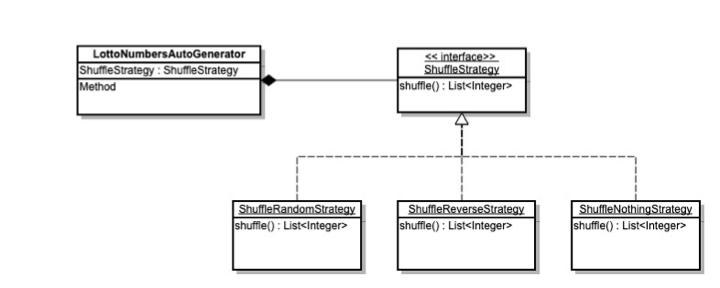
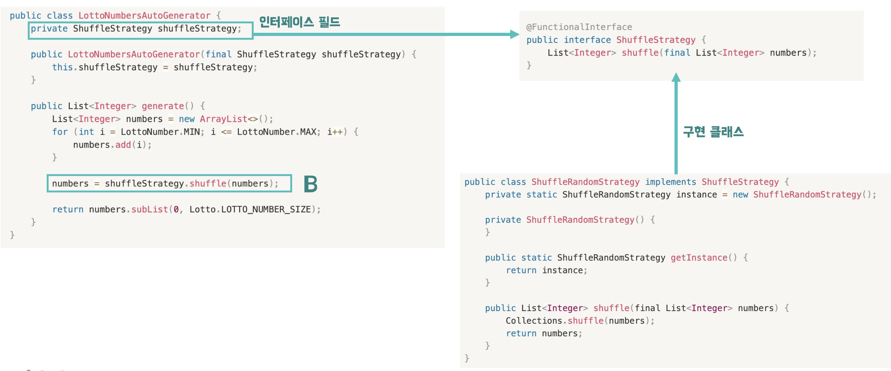

> 유튜브에 올라와 있는 10분 테코톡을 하루에 하나식 듣고 정리합니다. <br>
> 추가적인 궁금점이나 찾아볼 것이 있다면, 추가해서 기록합니다.

[[10분 테코톡] 👾제우스의 자바 제네릭](https://www.youtube.com/watch?v=Cr6mlXWZ35E&list=PLgXGHBqgT2TvpJ_p9L_yZKPifgdBOzdVH&index=2)

# OCP와 전략패턴


## if-else의 문제점

- 변경, 확장이 될 수록 **코드가 복잡해진다**.
- 코드를 **수정하거나 수정할 위치를 찾는데** 점점 오래 걸린다.
- 실수로 추가하지 않고 **누락하는 부분이 생길 가능성**이 있다.

```java
public List<Integer> generateLotto() {
  List<Integer> numbers = new ArrayList<>();
  for (int i = 1; i <= LOTTO_NUMBER_MAX; i++) {
    numbers.add(i);
  }

  if (shuffle == RANDOM) {
    Collections.shuffle(numbers);
  } else if (shuffle == NOTHING) {
    // 아무것도 하지 않음
  } else if (shuffle == REVERSE) {
    Collections.shuffle(numbers);
    Collections.reverse(numbers);
  } else if (shuffle == TEN_TO_TWENTY) {
    Collections.shuffle(numbers.subList(10, 21)); // 11~20 셔플
  } else if (shuffle == TWENTY_TO_THIRTY) {
    Collections.shuffle(numbers.subList(20, 31)); // 21~30 셔플
  } // ... (필요에 따라 추가)

  return numbers.subList(0, LOTTO_NUMBER_SIZE);
}
```

위의 예시는 **랜덤 로또 번호를 만드는 코드**이다. suffle변수의 값을 조건식으로 분기를 나눠서
다른 로직을 수행하는데, 초기에는 if-else블록이 크지않기 떄문에 이 방법으로 빠르게 구현해 나갈 수 있다.


하지만 나중에 **if-else 블록이 점점 커져서** 수백 줄 이상으로 빠르게 증가하면 코드가 복잡해지고,
특정 분기에 로직을 변경해야 할때 **해당되는 부분을 찾아서 수정하기가 쉽지 않아진다**.

그리고 개발을 하다보면 시간이 없어서 해당 if-else 로직구문을 그대로 다른곳에서 붙여넣어서 사용하고, 나중에 리팩토링해야지 라는 생각을 종종 하게 된다.

예를들어, 해당 if-else 로직구문을 쓰는 곳이 A, B, C파일이 있다면, 해당 로직구문에 변경이 있을때 그걸 일일히 A, B, C파일에 반영해줘야 하는데, 이떄 **누락이 생길 위험**도 있다.

이런 문제점들은 객체지향설계의 5대 원칙인 **SOLID중에 하나인 OCP를 준수하지 않아서 그런 것**인데, OCP가 무엇인지와 해결방법은 뭔지 알아보도록 하자.

## OCP란?

Open Close Principle: 개방폐쇄의 원칙

소프트웨어 구성 요소(컴포넌트, 클래스, 모듈, 함수 등)는 확장에 대해서는 개방되어야 하지만 **수정에 대해서는 폐쇄되어야 한다.**

**기존의 코드를 변경하지 않으면서** 기능을 추가할 수 있도록 설계가 되어야 한다는 뜻이다.

앞에 로또 번호 코드를 다시 살펴보자

```java
public List<Integer> generateLotto() {
  List<Integer> numbers = new ArrayList<>();
  for (int i = 1; i <= LOTTO_NUMBER_MAX; i++) {
    numbers.add(i);
  }

  if (shuffle == RANDOM) {
    Collections.shuffle(numbers);
  } else if (shuffle == NOTHING) {
    // 아무것도 하지 않음
  } else if (shuffle == REVERSE) {
    Collections.shuffle(numbers);
    Collections.reverse(numbers);
  } else if (shuffle == TEN_TO_TWENTY) {
    Collections.shuffle(numbers.subList(10, 21)); // 11~20 셔플
  } else if (shuffle == TWENTY_TO_THIRTY) {
    Collections.shuffle(numbers.subList(20, 31)); // 21~30 셔플
  } // ... (필요에 따라 추가)

  return numbers.subList(0, LOTTO_NUMBER_SIZE);
}
```
여기서 **앞뒤 절반을 각각 섞는 셔플 방식**을 추가한다고 가정해 보자. 이를 HALF_SHUFFLE이라는 값으로 표현해보겠다.

```java
else if (shuffle == HALF_SHUFFLE) {
  int half = numbers.size() / 2;
  Collections.shuffle(numbers.subList(0, half));
  Collections.shuffle(numbers.subList(half, numbers.size()));
}

```


위 코드처럼 새로운 셔플 방식을 추가하려면 generateLotto() **함수 내부의 if-else 문을 직접 수정해야 한다**

이는 기존의 코드를 변경하지 않으면서 기능을 추가해야하는 OCP원칙을 위반하는 것이다.

그럼 이 OCP원칙을 적용시키려면 어떻게 해야될까?

## OCP 적용방법 2가지

### 상속(Is-a)

- 상위 클래스를 상속받아 하위클래스를 이용한다.
- 하지만 상위 클래스와 하위 클래스의 강한 응집력으로 **상위 클래스가 바뀌면 하위 클래스에 끼치는 영향이 매우 큰 단점**이 있다.
- 따라서 상위 클래스를 애초에 충분한 확장성을 고려하지 않은 상태로 구현되면, 추후 하위 클래스에도 많은 변경이 일어나야 한다.

### 컴포지션(Has-a)

- **변경 될 것과 변하지 않을것을 엄격히 구분**한다.
- 이 중 **변경 될 것**을  인터페이스로서 정의한다.
- 변경 될 것과, 변하지 않을것 이 **두 모듈이 만나는 지점에 인터페이스를 정의**
- 구현에 의존하기보다 정의한 인터페이스에 의존하도록 코드를 작성

### 예시

컴포지션이 Has-a 관계를 의미한다고 생각하면 이해하기 쉽다.

예를들어
```java
class Car {
private Engine engine;  // Car has-a Engine
private List<Wheel> wheels; // Car has-a List of Wheels

    // ...
}
```
위처럼 자동차는 엔진과 바퀴를 가질 수(Has-a)있고, 해당 바퀴들을 인터페이스로 구현해 놓으면, 엔진이 V4에서 V6로 바뀌든,

바퀴가 금호타이어에서 넥센타이어로 바뀌든 본래 Car라는 코드에는 영향을 주지 않을 것이다.(개방에 확장, 수정에 폐쇠)

다시 랜덤 로또 번호 생성기로 돌아와서, 컴포지션을 도입해보자

- #### **변경 될 것과 변하지 않을것을 엄격히 구분**한다.

<div align='center'>
    
</div>

변경되지 않는 부분인 A와 변경되는 부분인 B로 구분하였다.

**변경되는 부분인 B를 인터페이스로서 정의해서 사용**할 것이다.


- #### 이 두 모듈이 만나는 지점에 인터페이스를 정의
<div align='center'>
    
</div>
주의 : 인터페이스에 의존해야지, 다른 코드에 의존하면 안된다.

기능 변경 위해서 코드를 수정해야 하면 원칙에 어긋나기 떄문이다.

**인터페이스는 변하는것과 변하지 않는 모듈의 교차점으로 서로를 보호하는 역할**을 한다.


- #### 인터페이스에 의존하도록 코드를 작성

<div align='center'>
    
</div>

`LottoNumbersAutoGeneratr`가 `ShuffleStrategy` 인터페이스에 의존하도록 하고

생성자 주입을 통해 구현 클래스의 인스턴스를 외부에서 주입하여 이용한다.

이런 방식을 DI(Dependency Injection) 라고 한다 (빈으로 등록했다면, @Autowired로 쉽게 의존성 주입을 할 수 있다.)

여기서 만약 수정되야 할 부분, 즉 셔플전략이 바뀐다?

그렇다면 해당  `ShuffleStrategy` 인터페이스를 구현한 다른 클래스를 주입해서 사용하면, 코드의 변경없이 사용가능 하다

=> OCP가 지켜지는 효과!


[Spring의 핵심 개념인 IOC와 DI가 뭔지 알고 싶다면?](https://jhy0285.github.io/posts/IOC%EC%99%80-DI%EB%9E%80/)

## 전략패턴(Strategy pattern)

소프트웨어 디자인 패턴 중 하나 (Strategy pattern)

전략 => 어떤 목적을 달성하기 위해 일을 수행하는 방식

**컴포지션 적용 자체도 일종의 전략 패턴**이라고 볼 수 있다.

즉 전략패턴이란, 전략을 쉽게 변경할 수 있도록 해주는 디자인 패턴으로, **행위를 담당하는 클래스를 캡슐화해 동적으로 행위를 자유롭게 바꿀 수 있게 해주는 패턴**을 의미한다.

새로운 기능의 추가가 기존의 코드에 영향을 미치지 못하게 하므로 OCP를 만족시킨다

위의 예시에서, 로또 번호를 만들어주는 generate() 메서드에 현재는 ShuffleRandomStrategy라는 전략을 사용해서 구현했지만,

Shuffle을 역순으로 하는 `ShuffleReverseStragtegy` class를 구현해서 주입하더라도

generate() 메서드의 코드 자체에 영향을 미치지 않고 기능 자체는 동작하게 된다.  => 전략을 바꿨을떄 기존 코드에 영향 X!!

## 전략 패턴의 구성요소

### Context

- **전략 패턴을 이용하는 역할**을 수행


- `Strategy 인터페이스`를 통해 `ConcreteStrategy 객체`와 상호작용한다.


- 의존성 주입(Dependency Injection, DI)을 통해 `ConcreteStrategy 객체`를 전달받는 것이 일반적이다. <br> => 필요에 따라 구체적인 전략을 바꿀 수 있도록 한다

### Strategy

- ConcreteStrategy 클래스들이 구현해야 하는 **공통 인터페이스 또는 추상 클래스**이다.


- **알고리즘을 실행하는 메서드를 정의한다**.


- ConcreteStrategy 클래스의 **구현 내용을 캡슐화하여 Context와의 결합도를 낮춘다**.

### ConcreateStrategy

- Strategy 인터페이스 또는 추상 클래스를 구현하여 **실제 알고리즘을 구현하는 클래스**이다.

- 여러 개의 ConcreteStrategy 클래스를 만들어 다양한 알고리즘을 제공할 수 있다.


위의 예시에서 `LottoNumbersAutoGenerator`가 Context

`ShuffleStrategy` 가 Strategy 인터페이스

`ShuffleRandomStrategy` 같은 구현체가 ConcreateStrategy에 해당한다.

전략패턴을 한줄로 요약하자면 => 기존의 코드 변경 없이 행위를 자유롭게 바꿀 수 있게 해주는 OCP의 디자인 패턴
