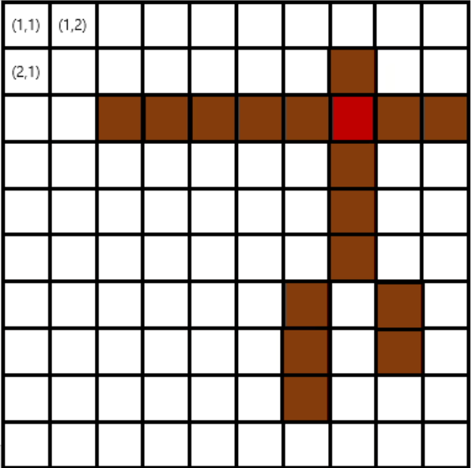

## 문제
[백준 쿠키의 신체 측정](https://www.acmicpc.net/problem/20125)

쿠키런은 데브시스터즈에서 제작한 모바일 러닝 액션 게임이다.

마녀의 오븐에서 탈출한 쿠키들과 함께 모험을 떠나는 게임으로, 점프와 슬라이드 2가지 버튼만으로 손쉽게 플레이할 수 있는 것이 특징이다.

연세대학교를 졸업한 김강산 선배님이 데브시스터즈에 취직하면서 주변 사람들에게 쿠키런을 전파시켰다.

하지만 게임을 전파하던 중에 쿠키들에게 신체적으로 이상이 생기는 것을 발견하였다. 팔, 다리 길이가 임의적으로 변한 것이다.

때문에 긴급하게 각 쿠키들의 신체들을 측정하려고 한다.

쿠키들은 신체를 측정하기 위해서 한 변의 길이가 N인 정사각형 판 위에 누워있으며, 어느 신체 부위도 판 밖으로 벗어나지 않는다. 

판의 x번째 행, y번째 열에 위치한 곳을 (x, y)로 지칭한다. 판의 맨 왼쪽 위 칸을 (1, 1), 오른쪽 아래 칸을 (N, N)으로 나타낼 수 있다.

<div align='center'>
    
</div>

그림과 같이 쿠키의 신체는 머리, 심장, 허리, 그리고 좌우 팔, 다리로 구성되어 있다.

그림에서 빨간 곳으로 칠해진 부분이 심장이다. 머리는 심장 바로 윗 칸에 1칸 크기로 있다.

왼쪽 팔은 심장 바로 왼쪽에 붙어있고 왼쪽으로 뻗어 있으며, 오른쪽 팔은 심장 바로 오른쪽에 붙어있고 오른쪽으로 뻗어있다.

허리는 심장의 바로 아래 쪽에 붙어있고 아래 쪽으로 뻗어 있다.

왼쪽 다리는 허리의 왼쪽 아래에, 오른쪽 다리는 허리의 오른쪽 아래에 바로 붙어있고, 각 다리들은 전부 아래쪽으로 뻗어 있다.

각 신체 부위들은 절대로 끊겨있지 않으며 굽혀진 곳도 없다. 또한, 허리, 팔, 다리의 길이는 1 이상이며, 너비는 무조건 1이다.

쿠키의 신체가 주어졌을 때 심장의 위치와 팔, 다리, 허리의 길이를 구하여라.


## 입력

다음과 같이 입력이 주어진다.

```text
N
a1,1 . . . a1,N
. . . . . .
aN,1 . . . aN,N
```

## 출력

첫 번째 줄에는 심장이 위치한 행의 번호 x와 열의 번호 y를 공백으로 구분해서 출력한다.

두 번째 줄에는 각각 왼쪽 팔, 오른쪽 팔, 허리, 왼쪽 다리, 오른쪽 다리의 길이를 공백으로 구분해서 출력하여라.

## 제한 

- 5 ≤ N ≤ 1,000. N은 판의 한 변의 길이를 의미하는 양의 정수다.
- a_{i,j}는 * 또는 _이다. *는 쿠키의 신체 부분이고, _는 쿠키의 신체가 올라가 있지 않은 칸을 의미한다. (1 ≤ i, j ≤ N)
- 쿠키의 신체 조건에 위배되는 입력은 주어지지 않는다.


## 예제 입출력

### 입력 1

```text
5
_____
__*__
_***_
__*__
_*_*_
```

### 출력 1


```text
3 3
1 1 1 1 1
```
### 입력 2

```text
10
__________
_____*____
__******__
_____*____
_____*____
_____*____
____*_*___
____*_____
____*_____
____*_____
```

### 출력 2


```text
3 6
3 2 3 4 1
```

### 입력 3

```text
9
____*____
*********
____*____
____*____
____*____
___*_*___
___*_*___
___*_*___
___*_*___
```

### 출력 3


```text
2 5
4 4 3 4 4
```

## 풀이
```python
import sys

size=int(sys.stdin.readline().rstrip())

board=[[0 for _ in range(size+1)] for _ in range(size+1)]


for row in range(1,size+1):
  line=sys.stdin.readline().rstrip()
  for col in range(1,len(line)+1):
    if(line[col-1]=='*'):
      board[row][col]=1


x,y=-1,-1
#좌상우하
dx=[-1,0,1,0]
dy=[0,1,0,-1]
#심장인지 아닌지를 판별하기 위한 배열
check=[False,False,False,False]
#심장의 좌표를 찾기위한 변수 선언
heart=(-1,-1)
for row in range(1,size+1):
  for col in range(1,size+1):
    x,y=row,col

    for i in range(4):
      temp_x=x+dx[i]
      temp_y=y+dy[i]
      #해당 좌표의 상하좌우중에 하나라도 board안에 없다면 => 다음 좌표로 넘어감
      if not 1<=temp_x<=size-1 or not 1<=temp_y<=size-1:
        break
      #해당 좌표의 상하좌우에 모두 쿠기가 존재하는지를 확인
      if board[temp_x][temp_y]==1:
        check[i]=True
    #해당 좌표의 상하좌우가 모두 쿠기가 존재한다면 => 해당 좌표는 heart가 됨
    if False not in check:
      heart=(x,y)
    check=[False,False,False,False]

#왼쪽 팔의 길이를 구하는 부분
left_arm=0
for idx in range(0,heart[1]):
  if board[heart[0]][idx]==1:
    left_arm+=1

#오른쪽 팔의 길이를 구하는 부분
right_arm=0
for idx in range(heart[1]+1,size+1):
  if board[heart[0]][idx]==1:
    right_arm+=1

#허리의 길이를 구하는 부분
middle=0
end_middle=0
for idx in range(heart[0]+1,size+1):
  if board[idx][heart[1]]==1:
    middle+=1
  else:
    end_middle=idx
    break

#왼쪽 다리의 길이를 구하는 부분
left_leg=0
for idx in range(end_middle,size+1):
  if board[idx][heart[1]-1]==1:
    left_leg+=1

#오른쪽 다리의 길이를 구하는 부분
right_leg=0
for idx in range(end_middle,size+1):
  if board[idx][heart[1]+1]==1:
    right_leg+=1


print(heart[0],heart[1])
print(left_arm,right_arm,middle,left_leg,right_leg)
```

## 설명

일단 처음에 쿠기가존재하는 부분, 즉 *은 1로 쿠기가 없는 - 부분은 0으로 2차원 board 정수 배열을 선언한다.

그런다음 심장의 좌표를 구해야하는데, 주어진 문제의 조건상, 반드시 심장의 상,하,좌,우에는 쿠기가 존재해야만하고,

동시에 오직 심장만이 상,하,좌,우에 쿠기가 존재한다.

따라서 board의 row, column을 돌면서 각 좌표의 상화좌우를 탐색하여 => 상하좌우가 모두 쿠기가 존재하는지를 탐색하여 심장의 좌표를 구한다

그런다음 주어진 조건에 따라 심장의 왼쪽 가로, 오른쪽 가로가 각각 왼팔, 오른팔이고, 심장의 밑으로 직선인 쿠기의 수가 허리이고,

허리의 왼쪽 밑 직선과 오른쪽 밑 직선이 각각 왼쪽 다리, 오른쪽 다리 임을 이용해서 각 길이를 구하면 된다.


