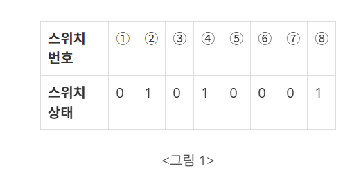
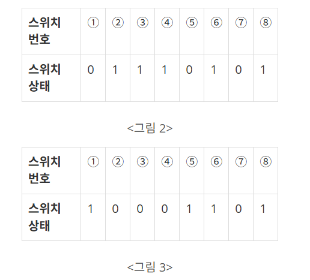

## 문제
[백준 스위치 켜고 끄기](https://www.acmicpc.net/problem/1244)

1부터 연속적으로 번호가 붙어있는 스위치들이 있다. 스위치는 켜져 있거나 꺼져있는 상태이다. <그림 1>에 스위치 8개의 상태가 표시되어 있다. ‘1’은 스위치가 켜져 있음을, ‘0’은 꺼져 있음을 나타낸다.

그리고 학생 몇 명을 뽑아서, 학생들에게 1 이상이고 스위치 개수 이하인 자연수를 하나씩 나누어주었다. 학생들은 자신의 성별과 받은 수에 따라 아래와 같은 방식으로 스위치를 조작하게 된다.

남학생은 스위치 번호가 자기가 받은 수의 배수이면, 그 스위치의 상태를 바꾼다. 즉, 스위치가 켜져 있으면 끄고, 꺼져 있으면 켠다. 

<그림 1>과 같은 상태에서 남학생이 3을 받았다면, 이 학생은 <그림 2>와 같이 3번, 6번 스위치의 상태를 바꾼다.

여학생은 자기가 받은 수와 같은 번호가 붙은 스위치를 중심으로 좌우가 대칭이면서 가장 많은 스위치를 포함하는 구간을 찾아서, 그 구간에 속한 스위치의 상태를 모두 바꾼다. 

이때 구간에 속한 스위치 개수는 항상 홀수가 된다.

<div align='center'>
    
</div>

예를 들어 <그림 2>에서 여학생이 3을 받았다면, 3번 스위치를 중심으로 2번, 4번 스위치의 상태가 같고 1번, 5번 스위치의 상태가 같으므로, <그림 3>과 같이 1번부터 5번까지 스위치의 상태를 모두 바꾼다.

만약 <그림 2>에서 여학생이 4를 받았다면, 3번, 5번 스위치의 상태가 서로 다르므로 4번 스위치의 상태만 바꾼다.

<div align='center'>
    
</div>

입력으로 스위치들의 처음 상태가 주어지고, 각 학생의 성별과 받은 수가 주어진다. 

학생들은 입력되는 순서대로 자기의 성별과 받은 수에 따라 스위치의 상태를 바꾸었을 때, 스위치들의 마지막 상태를 출력하는 프로그램을 작성하시오.

## 입력

첫째 줄에는 스위치 개수가 주어진다. 스위치 개수는 100 이하인 양의 정수이다. 둘째 줄에는 각 스위치의 상태가 주어진다. 

켜져 있으면 1, 꺼져있으면 0이라고 표시하고 사이에 빈칸이 하나씩 있다. 셋째 줄에는 학생수가 주어진다. 학생수는 100 이하인 양의 정수이다.

넷째 줄부터 마지막 줄까지 한 줄에 한 학생의 성별, 학생이 받은 수가 주어진다. 남학생은 1로, 여학생은 2로 표시하고, 학생이 받은 수는 스위치 개수 이하인 양의 정수이다. 

학생의 성별과 받은 수 사이에 빈칸이 하나씩 있다.


## 출력
스위치의 상태를 1번 스위치에서 시작하여 마지막 스위치까지 한 줄에 20개씩 출력한다. 

예를 들어 21번 스위치가 있다면 이 스위치의 상태는 둘째 줄 맨 앞에 출력한다.

켜진 스위치는 1, 꺼진 스위치는 0으로 표시하고, 스위치 상태 사이에 빈칸을 하나씩 둔다.

## 예제 입출력

### 입력 1

```text
8
0 1 0 1 0 0 0 1
2
1 3
2 3
```

### 출력 1


```text
1 0 0 0 1 1 0 1
```


## 풀이
```python
import sys

switch_num=int(sys.stdin.readline().rstrip())
switch= list(map(int, sys.stdin.readline().rstrip().split(" ")))
student_num=int(sys.stdin.readline().rstrip())

for _ in range(student_num):
  gender,num=map(int,sys.stdin.readline().rstrip().split(" "))
  #남자면
  if gender == 1:
    added=num
    while num<=switch_num:
      switch[num-1]=1 if switch[num-1]==0 else 0
      num+=added
  #여자면
  else:
    switch[num-1]=1 if switch[num-1]==0 else 0
    left,right=num-1,num+1

    while  (left >=1 and right<=switch_num) and switch[left-1]==switch[right-1] :
      switch[left-1] = 1 if switch[left-1] == 0 else 0
      switch[right-1] = 1 if switch[right-1] == 0 else 0
      left-=1
      right+=1


start=0
end=20
while end<=switch_num:
  print(*switch[start:end])
  start+=20
  end+=20

print(*switch[start:])
```

## 설명

조건을 살펴보자

남자라면 처음에 주어진 자기 숫자의 배수들의 스위치 값을 바꿔 줘야하므로, 기존에 받았던 숫자를 `added`변수에 할당한다

처음에 생각없이 num+=num을 해버려서 문제가 해결되지 않았던 기억이 있다.

여자라면 처음에 받았던 스위치는 반드시 값이 바뀌고, 그 다음부터 각 좌우를 left, right 변수로 선언해 양 옆으로 퍼져나가면서 서로 스위치 상태가 같은지 조사한다.

이때   `(left >=1 and right<=switch_num) and switch[left-1]==switch[right-1]` 이 조건문의 순서가 바뀌면 Index Error가 발생한다.

그 이유는 and 연산자 사용시 **A and B 일떄 A가 거짓이라면 B는 살펴보지 않고 바로 Fasle 값을 리턴**하는데,

만약 순서가 `switch[left-1]==switch[right-1] and (left >=1 and right<=switch_num)`라면 left-1에서 left==0일경우 left-1==-1 이므로 O**ut of Index 에러가 발생**하는 것이다.

