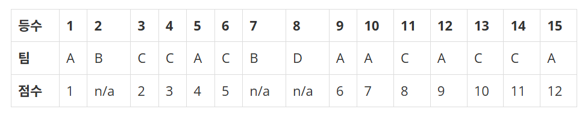

## 문제
[백준 크로스 컨트리](https://www.acmicpc.net/problem/9017)

크로스 컨트리 달리기는 주자들이 자연적인 야외의 지형에 만들어진 코스를 달리는 운동 경기이다. 경주 코스는 일반적으로 4에서 12 킬로미터이며, 숲이나 넓은 땅을 통과하는 풀과 흙으로 된 지면과 언덕과 평평한 지형을 포함한다.

이 경기는 주자들의 개인성적을 매기고, 이를 가지고 팀의 점수를 계산한다.

한 팀은 여섯 명의 선수로 구성되며, 팀 점수는 상위 네 명의 주자의 점수를 합하여 계산한다. 

점수는 자격을 갖춘 팀의 주자들에게만 주어지며, 결승점을 통과한 순서대로 점수를 받는다. 이 점수를 더하여 가장 낮은 점수를 얻는 팀이 우승을 하게 된다. 

여섯 명의 주자가 참가하지 못한 팀은 점수 계산에서 제외된다. 동점의 경우에는 다섯 번째 주자가 가장 빨리 들어온 팀이 우승하게 된다.

예를 들어, 다음의 표를 살펴보자.

<div align='center'>
    
</div>

팀 B 와 D 는 선수의 수가 여섯이 아니므로, 점수를 받을 수 없다.

팀 A 의 점수는 18 (1+4+6+7)이고, 팀 C 의 점수는 18 (2+3+5+8)이다. 

이 경우 두 팀의 점수가 같으므로 다섯 번째로 결승점을 통과한 선수를 고려한다, A 팀의 다섯 번째 선수의 점수가 C 팀의 다섯 번째 선수의 점수보다 적으므로 A 팀이 우승팀이 된다.

모든 선수들의 등수가 주어질 때, 우승팀을 구하는 프로그램을 작성하라. 

각 팀의 참가 선수가 여섯보다 작으면 그 팀은 점수 계산에서 제외됨을 주의하라. 

여섯 명 보다 많은 선수가 참가하는 팀은 없고, 적어도 한 팀은 참가 선수가 여섯이며, 모든 선수는 끝까지 완주를 한다고 가정한다.

## 입력

입력 데이터는 표준입력을 사용한다. 입력은 T 개의 테스트 케이스로 주어진다. 입력 파일의 첫 번째 줄에 테스트 케이스의 수를 나타내는 정수 T 가 주어진다. 

두 번째 줄부터는 두 줄에 하나의 테스트 케이스에 해당하는 데이터가 주어진다. 

각 테스트 케이스의 첫 번째 줄에는 하나의 정수 N (6 ≤ N ≤ 1,000)이 주어진다. 두 번째 줄에는 팀 번호를 나타내는 N 개의 정수 t1, t2, …, tN 이 공백을 사이에 두고 주어진다. 

각 팀은 1 과 M(1 ≤ M ≤ 200)사이의 정수로 표현된다.


## 출력
출력은 표준출력을 사용한다. 하나의 테스트 케이스에 대한 우승팀의 번호를 한 줄에 출력한다.

## 예제 입출력

### 입력 1

```text
2
15
1 2 3 3 1 3 2 4 1 1 3 1 3 3 1
18
1 2 3 1 2 3 1 2 3 3 3 3 2 2 2 1 1 1
```

### 출력 1


```text
1
3
```


## 풀이
```python
import sys
from collections import defaultdict

trial = int(sys.stdin.readline().rstrip())
for _ in range(trial):
  score_cnt = defaultdict(int)
  total = int(sys.stdin.readline().rstrip())
  race_result = list(map(int, sys.stdin.readline().rstrip().split(" ")))

  #여섯 명의 주자를 가지고 팀들의 race_result를 구하기위한 score_cnt 계산
  for idx in range(total):
    score_cnt[race_result[idx]] += 1

  #score_cnt를 통해 race_result 계산
  for key, value in score_cnt.items():
    if not value == 6:
      while key in race_result:
        race_result.remove(key)

  #후보팀들의 상위 4명 점수의 총합과 6명의 등수(점수)를 구하는 로직
  total=len(race_result)
  score_sum=defaultdict(int)
  score_list=defaultdict(list)
  add_only_four=defaultdict(int)
  for idx in range(total):
    if add_only_four[race_result[idx]]<4:
      score_sum[race_result[idx]] += idx+1
      add_only_four[race_result[idx]] += 1
    score_list[race_result[idx]].append(idx)

  #후보팀들의 점수의 총합중 최소값을 구함
  min_sum=min(score_sum.values())

  #최소값이 같은게 여러개 있다면 그중 5번쨰 선수의 점수를 비교해서 정답을 구함
  answer=0
  min_fifth=1001
  for key,value in score_sum.items():
    if value == min_sum:
      if score_list[key][4]<min_fifth:
        min_fifth=score_list[key][4]
        answer=key

  print(answer)

```

## 설명

처음에 문제를 제대로 읽지않아서 헤매었던 기억이 있다.

3가지 낚시?조건을 잘 해석해야된다.

1. 점수(등수)계산시에, 골인한 인원이 6명 미만(5명 이하)팀은 점수계산에 포함되지 않는다.


2. 골인한 인원이 6명인 팀들의 경우 점수의 총합을 구해야되는데, 상위 4명의 점수만 총합으로 계산한다


3. 점수의 총합이 같을 수 있는데, 이럴때는 5번째 선수의 점수가 낮은(등수가 빠른)팀이 우승팀이다.

사실 3가지 조건이 숨겨진게 아니라, 문제에서 전부 명시적으로 제시하였기 떄문에, 문제를 찬찬히 잘 읽어본다면 조건에 따라 구현하면 되는 문제이다.


