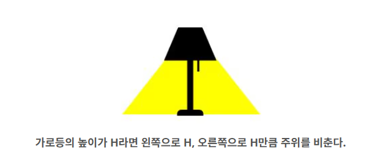
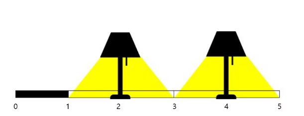
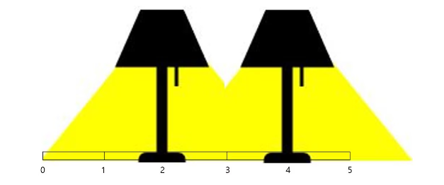

## 문제
[백준 어두운 굴다리](https://www.acmicpc.net/problem/17266)

인하대학교 후문 뒤쪽에는 어두운 굴다리가 있다. 겁쟁이 상빈이는 길이 조금이라도 어둡다면 가지 않는다. 

따라서 굴다리로 가면 최단거리로 집까지 갈수 있지만, 굴다리는 어둡기 때문에 빙빙 돌아서 집으로 간다.

안타깝게 여긴 인식이는 굴다리 모든 길 0~N을 밝히게 가로등을 설치해 달라고 인천광역시에 민원을 넣었다.

인천광역시에서 가로등을 설치할 개수 M과 각 가로등의 위치 x들의 결정을 끝냈다. 그리고 각 가로등은 높이만큼 주위를 비출 수 있다. 

하지만 갑자기 예산이 부족해진 인천광역시는 가로등의 높이가 높을수록 가격이 비싸지기 때문에 최소한의 높이로 굴다리 모든 길 0~N을 밝히고자 한다. 최소한의 예산이 들 높이를 구하자. 

단 가로등은 모두 높이가 같아야 하고, 정수이다.

다음 그림을 보자.

<div align='center'>
    
</div>

다음 그림은 예제1에 대한 설명이다.

<div align='center'>
    
</div>

가로등의 높이가 1일 경우 0~1사이의 길이 어둡기 때문에 상빈이는 지나가지 못한다.

아래 그림처럼 높이가 2일 경우 0~5의 모든 길이 밝기 때문에 상빈이는 지나갈 수 있다.

<div align='center'>
    
</div>


## 입력

첫 번째 줄에 굴다리의 길이 N 이 주어진다. (1 ≤ N ≤ 100,000)

두 번째 줄에 가로등의 개수 M 이 주어진다. (1 ≤ M ≤ N)

다음 줄에 M 개의 설치할 수 있는 가로등의 위치 x 가 주어진다. (0 ≤ x ≤ N)

가로등의 위치 x는 오름차순으로 입력받으며 가로등의 위치는 중복되지 않으며, 정수이다.

## 출력
굴다리의 길이 N을 모두 비추기 위한 가로등의 최소 높이를 출력한다.

## 예제 입출력

### 입력 1

```text
5
2
2 4
```

### 출력 1


```text
2
```

### 입력 2

```text
3
1
0
```

### 출력 2


```text
3
```


## 풀이
```python
import sys
import math

bridge_length=int(sys.stdin.readline().rstrip())
light_cnt=int(sys.stdin.readline().rstrip())
light_point=list(map(int,sys.stdin.readline().rstrip().split()))

answer=[]

#맨앞가로등은 light_point[0]이상의 높이를 가져야한다
answer.append(light_point[0])

#맨뒤가로등은 right-light_point[-1] 이상의 높이를 가져야한다
answer.append(bridge_length-light_point[-1])

# 가로등이 1개라면 밑에과정 할필요 없음
if(len(light_point)==1):
    print(max(answer))

# 좌표들 사이의 가장긴거리 // 2 이상의 높이를 가져아한다.
else:
    point_distance=[]
    for idx in range(0,len(light_point)-1):
        point_distance.append(light_point[idx+1]-light_point[idx])
    answer.append(math.ceil(max(point_distance)/2))
    print(max(answer))
```

## 설명

처음에는 십만사이의 높이를 구하는 이분탐색의 방식으로 풀려고하였다.

하지만 잘 생각해보니, 3가지 케이스만 조사하면 답을 구할 수 있을거 같았다.

1. 처음 가로등의 좌표 값과 다리의 시작(좌표 0)까지의 거리를 비출 수 있는 높이여야 한다.


2. 마지막 가로등의 좌표 값과 다리의 끝(좌표 bridge_length, 즉 다리의 길이)까지의 거리를 비출 수있는 높이여야 한다.


3. 좌표 사이의 거리가 가장 긴 값 // 2 보다는 높은 높이여야 한다.


위 3가지 조건 값중 가장 큰 값이 반드시 정답이여야 한다. 

따라서 위조건을 각각 구하는데, 이떄 가로등이 1개일때는 3.의 과정을 할필요가 없으므로 조건절로 구분한다.
