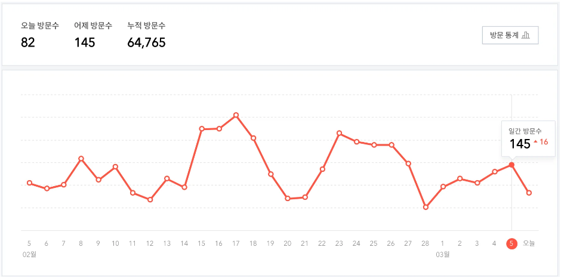

## 문제
[백준 블로그](https://www.acmicpc.net/problem/21921)

찬솔이는 블로그를 시작한 지 벌써 N일이 지났다.

요즘 바빠서 관리를 못 했다가 방문 기록을 봤더니 벌써 누적 방문 수가 6만을 넘었다.

<div align='center'>
    
</div>

찬솔이는 X일 동안 가장 많이 들어온 방문자 수와 그 기간들을 알고 싶다.

찬솔이를 대신해서 X일 동안 가장 많이 들어온 방문자 수와 기간이 몇 개 있는지 구해주자.

## 입력

첫째 줄에 블로그를 시작하고 지난 일수 N와 X가 공백으로 구분되어 주어진다.

둘째 줄에는 블로그 시작 1일차부터 N일차까지 하루 방문자 수가 공백으로 구분되어 주어진다.

## 출력

첫째 줄에 X일 동안 가장 많이 들어온 방문자 수를 출력한다. 만약 최대 방문자 수가 0명이라면 SAD를 출력한다.

만약 최대 방문자 수가 0명이 아닌 경우 둘째 줄에 기간이 몇 개 있는지 출력한다.

## 제한

- 1 <= X <= N <= 250,000
- 0 <= 방문자 수 <= 8,000


## 예제 입출력

### 입력 1

```text
5 2
1 4 2 5 1
```

### 출력 1


```text
7
1
```
### 입력 2

```text
7 5
1 1 1 1 1 5 1
```

### 출력 2


```text
9
2
```
### 입력 3

```text
5 3
0 0 0 0 0
```

### 출력 3


```text
SAD
```

## 풀이
```python
import sys

n,x=map(int, sys.stdin.readline().rstrip().split(" "))
visitor_list=list(map(int,sys.stdin.readline().rstrip().split(" ")))


#합을 계산할떄 누적합 개념을 이용하자!
sub_sum=[0 for i in visitor_list]
sub_sum[0]=visitor_list[0]
for idx in range(1,len(visitor_list)):
  sub_sum[idx]=sub_sum[idx-1]+visitor_list[idx]


max_value=sub_sum[x-1]
cnt=1
#주어진 X일 동안 가장 많이들어온 구간을 찾기위해 앞서 구한 누적합을 이용한다
#예를들어 2~5일동안의 누적 유저들의 합은 sub_sum[4]-sub_sum[1]을 하면된다. (인덱스는 0부터 시작하므로)
for idx in range(x,n):
  compared=sub_sum[idx]-sub_sum[idx-x]
  if compared > max_value:
    max_value=compared
    cnt=1
  elif compared == max_value:
    cnt+=1
  else:
    continue

if(max_value==0):
  print("SAD")
else:
  print(max_value)
  print(cnt)
```

## 설명

처음에는 누적합 개념을 사용하지않고, for 문안에 **sum메서드**를 사용해서 정답을 구했다.

하지만 sum또한 O(n)이고, 반복문도 O(n)이기에 결국 O(n^2)이 되고, 이는 최악의 경우  

250,000 의 제곱이 되므로, 주어진 제한시간안에 절대 수행될수 없을거 같았다.

역시나 결과는 시간초과 였다.

그래서 n^2을 n, 또는 하다못해 nlogn의 복잡도로 줄일 수 있을지 생각해보던중, **누적합 개념을 적용**하게 되었다.

누적합은 **합을 구할때 그 앞서 누적되었던 합의 값을 이용해서 구하는 것**이다. 쉽게 말해

1~N까지의 합은 1~N-1까지의 합에다가 N을 더해서 구하고, 

1~N-1까지의 합은 1~N-2까지의 합에다가 N-1을 더해서 구하는 식으로 계산하는 것이다.

필자는 우선 `sub_sum`이라는 누적합 리스트를 선언하였다. 이 리스트의 i번쨰 값은 방문자리스트인 `visitor_list`의 0번째부터 i번쨰까지의 합을 의미한다.

그런 다음  `visitor_list`의 n번째~m번쨰까지의 합은  `sub_sum[m]`- `sub_sum[n-1]`으로 구한다.

이러면  **sum메서드** 대신에 인덱스 접근, 즉 O(1)로 합을 계산할 수 있기떄문에 시간복잡도는 O(n)이 된다.

따라서 누적합 개념을 이용해 시간초과 없이 문제를 해결 할 수 있었다.


